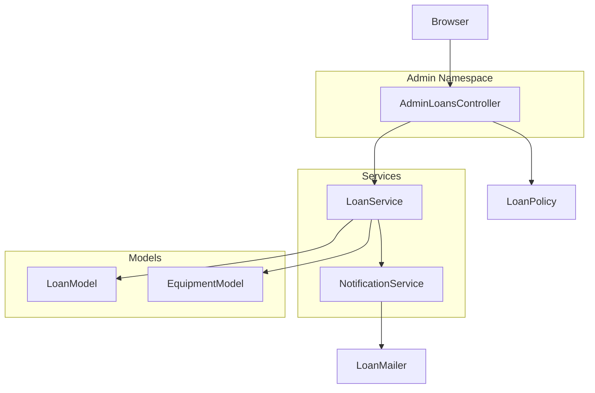
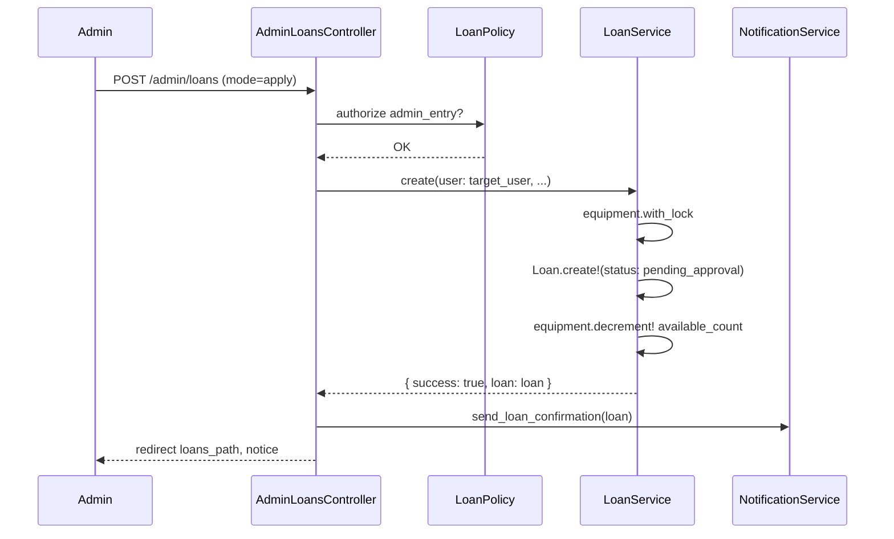

# Design Document: admin-loan-entry

## Overview

本機能は、管理者ユーザーが任意の利用者を指定して代理で貸出申請（`pending_approval`）または貸出記録の直接登録（`active`）を行えるようにする。

**Purpose**: 利用者がシステムを操作できない状況での代理申請、および物理的な貸出が先行した場合の事後記録入力に対応する。
**Users**: `admin` ロールを持つ管理者が対象。一般利用者（`member`）はアクセス不可。
**Impact**: 既存の `loans` テーブル・`LoanService` を拡張する。スキーマ変更は不要。

### Goals

- 管理者が対象ユーザーを指定して貸出申請を代理作成できる
- 管理者が承認フローを経ず `active` 状態の貸出記録を直接登録できる
- 既存の在庫ロック・通知・バリデーションロジックをそのまま活用する

### Non-Goals

- 一般ユーザーへの代理申請権限の付与
- 貸出記録の編集・削除（既存機能のスコープ外）
- 返却予定日を過去日で登録することは許可しない

---

## Architecture

### Existing Architecture Analysis

現行の貸出フローは `LoansController` → `LoanService` → `Loan` モデルの3層構成。コントローラは `current_user` を `LoanService#create` に渡す設計になっている。管理者名前空間 `Admin::` はすでに `Admin::DashboardsController`・`Admin::UsersController` で確立済み。

### Architecture Pattern & Boundary Map



**Architecture Integration**:
- 選択パターン: 既存 MVC + Service Object 拡張
- 新コンポーネント: `Admin::LoansController`（管理者名前空間）、`LoanPolicy#admin_entry?`（認可）、`LoanService#admin_direct_entry`（直接記録）
- 既存パターン保持: `with_lock` による排他制御、`NotificationService` 経由のメール送信、Pundit による認可
- ステアリング準拠: Fat Model 回避・Controller は薄く・認可は Policy に集約

### Technology Stack

| Layer | 選択 / バージョン | 役割 | 備考 |
|-------|-----------------|------|------|
| View | ERB + Tailwind CSS | 管理者代理貸出フォーム | 既存スタイルに準拠 |
| Controller | Rails 8.1.2（Admin::LoansController） | リクエスト受付・モード分岐 | admin 名前空間に配置 |
| Service | LoanService（既存拡張） | 在庫ロック・貸出作成・通知 | admin_direct_entry メソッド追加 |
| Policy | LoanPolicy（既存拡張） | 管理者認可チェック | admin_entry? メソッド追加 |
| Model | Loan / Equipment / User（変更なし） | データ永続化 | スキーマ変更不要 |
| DB | PostgreSQL | トランザクション・排他ロック | 既存設定のまま |

---

## System Flows

### 代理貸出申請フロー（mode: apply）



### 直接記録登録フロー（mode: direct）

代理申請フローと同一構造。差異は `LoanService#admin_direct_entry` を呼び出し、`status: :active` でレコードを生成する点のみ。

---

## Requirements Traceability

| 要件 | 概要 | コンポーネント | インターフェース | フロー |
|------|------|----------------|----------------|--------|
| 1.1 | 代理申請 pending_approval 作成 | Admin::LoansController, LoanService | create(user: target_user) | apply フロー |
| 1.2 | 代理申請成功時メール送信 | NotificationService | send_loan_confirmation | apply フロー |
| 1.3 | 在庫 0 時申請拒否 | LoanService | create → :out_of_stock | apply / direct フロー |
| 1.4 | 無効備品の申請拒否 | LoanService | create → :equipment_not_available | apply / direct フロー |
| 1.5 | 排他ロックで二重減算防止 | LoanService | with_lock | apply / direct フロー |
| 1.6 | 低在庫アラート送信 | NotificationService | send_low_stock_alert | apply / direct フロー |
| 2.1 | 直接記録 active 作成 | Admin::LoansController, LoanService | admin_direct_entry | direct フロー |
| 2.2 | 直接記録時 available_count 減算 | LoanService | admin_direct_entry | direct フロー |
| 2.3 | 直接記録成功時メール送信 | NotificationService | send_loan_confirmation | direct フロー |
| 2.4–2.6 | 在庫・ロック（直接記録） | LoanService | admin_direct_entry | direct フロー |
| 3.1–3.3 | ユーザー選択 | Admin::LoansController, View | new アクション | - |
| 4.1–4.3 | 認可制御 | LoanPolicy | admin_entry? | 全フロー |
| 5.1–5.3 | 入力バリデーション | LoanService, Loan モデル | validates / errors | 全フロー |

---

## Components and Interfaces

### 概要テーブル

| Component | Layer | Intent | 要件カバレッジ | 主要依存 | Contracts |
|-----------|-------|--------|--------------|----------|-----------|
| Admin::LoansController | Controller | 代理申請・直接記録のリクエスト処理 | 1.1, 2.1, 3.1–3.3, 4.1–4.3, 5.1–5.3 | LoanService (P0), LoanPolicy (P0) | API |
| LoanPolicy#admin_entry? | Policy | 管理者専用アクションの認可 | 4.1–4.3 | User#admin? (P0) | Service |
| LoanService#admin_direct_entry | Service | active 状態の貸出記録直接生成 | 2.1–2.6 | Equipment (P0), NotificationService (P1) | Service |
| admin/loans/new.html.erb | View | 代理貸出フォーム（モード切替・ユーザー選択） | 3.1–3.3, 5.3 | - | - |

---

### Controller Layer

#### Admin::LoansController

| Field | Detail |
|-------|--------|
| Intent | 管理者代理貸出の新規フォーム表示と登録処理 |
| Requirements | 1.1, 2.1, 3.1, 3.2, 3.3, 4.1, 5.1, 5.2, 5.3 |

**Responsibilities & Constraints**
- `new`: フォーム用の `@users`（全ユーザー）・`@equipments`（有効・貸出可能備品）を取得して View に渡す
- `create`: `mode` パラメータに応じて `LoanService#create`（apply）または `LoanService#admin_direct_entry`（direct）を呼び分ける
- 認可は `LoanPolicy#admin_entry?` に委譲。コントローラ内でのロール直接判定は行わない

**Dependencies**
- Inbound: ブラウザ（管理者ユーザー） — HTTPリクエスト (P0)
- Outbound: LoanService — 貸出作成ロジック (P0)
- Outbound: LoanPolicy — 認可判定 (P0)

**Contracts**: API [x]

##### API Contract

| Method | Endpoint | Request Body | Response | Errors |
|--------|----------|--------------|----------|--------|
| GET | /admin/loans/new | - | フォーム HTML | 403（非管理者） |
| POST | /admin/loans | loan[user_id], loan[equipment_id], loan[start_date], loan[expected_return_date], loan[mode] | redirect loans_path | 403（非管理者）、422（バリデーション失敗） |

**Implementation Notes**
- `loan_params` に `user_id` と `mode` を追加（`permit(:user_id, :equipment_id, :start_date, :expected_return_date, :mode)`）
- `target_user = User.find(params[:loan][:user_id])` で対象ユーザーを取得
- apply モード: 既存 `LoanService#create(user: target_user, ...)` を呼ぶ（LoanService 変更不要）
- direct モード: `LoanService#admin_direct_entry(user: target_user, ...)` を呼ぶ
- バリデーションエラー時は `@users`・`@equipments` を再セットして `render :new` を返す

---

### Service Layer

#### LoanService#admin_direct_entry（新規追加）

| Field | Detail |
|-------|--------|
| Intent | 管理者が `active` 状態の貸出を直接生成する（承認フロー不要） |
| Requirements | 2.1, 2.2, 2.3, 2.4, 2.5, 2.6 |

**Responsibilities & Constraints**
- `active` ステータスで Loan レコードを作成し、`available_count` を 1 デクリメントする
- `equipment.with_lock` による排他ロックで在庫整合性を保証する
- 在庫チェック・ソフトデリートチェック・ステータスチェックは `create` と同一ロジックを適用する
- 低在庫閾値チェックと通知送信は `create` と同様に行う

**Dependencies**
- Inbound: Admin::LoansController (P0)
- Outbound: Equipment（在庫ロック・デクリメント）(P0)
- Outbound: NotificationService（貸出確認メール・低在庫アラート）(P1)

**Contracts**: Service [x]

##### Service Interface

```ruby
# @param user [User] 貸出対象の利用者
# @param equipment_id [String] UUID
# @param start_date [Date]
# @param expected_return_date [Date]
# @return [Hash] { success: Boolean, loan: Loan, error: Symbol, message: String }
def admin_direct_entry(user:, equipment_id:, start_date:, expected_return_date:)
```

- Preconditions: `user` は有効な User、`equipment_id` は存在する Equipment の ID
- Postconditions: 成功時は `status: :active` の Loan が永続化され、`equipment.available_count` が 1 減算される
- Invariants: `available_count >= 0` を保証（在庫 0 の場合はエラーを返す）

**Implementation Notes**
- `create` メソッドとの差異は `status: :active` 固定のみ。内部の在庫ロック・チェック・通知ロジックはプライベートメソッドに抽出して共有することを推奨
- エラー種別: `:equipment_not_available`（備品無効）、`:out_of_stock`（在庫 0）、`:validation_failed`（バリデーション）

---

### Policy Layer

#### LoanPolicy#admin_entry?（新規追加）

| Field | Detail |
|-------|--------|
| Intent | 管理者代理貸出操作の実行権限を admin ロールに限定する |
| Requirements | 4.1, 4.2, 4.3 |

**Contracts**: Service [x]

##### Service Interface

```ruby
# @return [Boolean]
def admin_entry?
  user.admin?
end
```

**Implementation Notes**
- `AdminLoansController#new` および `#create` の両アクションで `authorize Loan, :admin_entry?` を呼ぶ
- 非管理者は `Pundit::NotAuthorizedError` → `ApplicationController#user_not_authorized` で 403 を返す

---

### View Layer

#### admin/loans/new.html.erb（新規追加）

| Field | Detail |
|-------|--------|
| Intent | 管理者代理貸出フォーム（モード選択・ユーザー選択・備品選択・日付入力） |
| Requirements | 3.1, 3.2, 3.3, 5.3 |

**Implementation Notes**
- `form_with model: [:admin, @loan], url: admin_loans_path` でフォームを定義
- `mode` フィールド: ラジオボタン（`apply` / `direct`）でモードを切り替え
- ユーザー選択: `select` タグに `@users` をループし `"#{user.name}（#{user.email}）"` 形式で表示（要件 3.2）
- 備品選択: `@equipments`（`available` / `in_use` のみ）をセレクトボックスで表示
- バリデーションエラー時は `@loan.errors` を表示し入力値を保持（要件 5.3）

---

## Data Models

### Domain Model

既存スキーマを変更しない。`Loan` モデルは `status` に `active` の値を持つため、直接記録も既存テーブルで対応可能。

### Logical Data Model

本機能で変更・追加されるテーブル: **なし**。既存 `loans` テーブルの `status` カラムに `active` 値で書き込むのみ。

関与するエンティティ:
- `loans`: `user_id`（代理申請対象ユーザー）・`equipment_id`・`start_date`・`expected_return_date`・`status`
- `equipments`: `available_count`（デクリメント対象）
- `users`: 管理者がユーザー選択に使用

---

## Error Handling

### Error Strategy

Service Object が `{ success: false, error: Symbol, message: String }` を返し、Controller が flash メッセージで表示する。既存の `LoanService#create` と同一パターンを踏襲する。

### Error Categories and Responses

| カテゴリ | 条件 | error シンボル | ユーザーへの表示 |
|---------|------|--------------|--------------|
| ビジネスロジック | 在庫 0 | `:out_of_stock` | 「現在在庫がありません」 |
| ビジネスロジック | 備品無効 / 削除済み | `:equipment_not_available` | 「指定された備品は利用できません」 |
| バリデーション | 日付不正・必須未入力 | `:validation_failed` | `loan.errors.full_messages` |
| 認可 | 非管理者アクセス | - | 403 Forbidden（`Pundit::NotAuthorizedError`） |

### Monitoring

- `NotificationService` はメール送信失敗時に `Rails.logger.error` で記録（既存パターン踏襲）

---

## Testing Strategy

### Unit Tests（spec/services/loan_service_spec.rb に追加）

- `admin_direct_entry`: 成功時に `active` ステータスの Loan を作成し `available_count` を減算する
- `admin_direct_entry`: 在庫 0 の場合に `:out_of_stock` を返し Loan を作成しない
- `admin_direct_entry`: 無効備品の場合に `:equipment_not_available` を返す
- `admin_direct_entry`: 同時実行時に排他ロックで二重減算を防止する

### Unit Tests（spec/policies/loan_policy_spec.rb に追加）

- `admin_entry?`: admin ユーザーに対して `true` を返す
- `admin_entry?`: member ユーザーに対して `false` を返す

### Integration Tests（spec/requests/admin/loans_controller_spec.rb）

- GET `/admin/loans/new`: 管理者はアクセス可能、member は 403
- POST `/admin/loans`（mode: apply）: 成功時に `pending_approval` の Loan が生成される
- POST `/admin/loans`（mode: direct）: 成功時に `active` の Loan が生成される
- POST `/admin/loans`: バリデーションエラー時に 422 とフォームが返される

### E2E Tests

- 管理者ログイン → 代理申請フォーム表示 → ユーザー選択 → 送信 → 一覧に申請が表示される
- 直接記録モードで登録した貸出が `active` 状態で一覧に表示される

---

## Security Considerations

- 全アクションで `authorize Loan, :admin_entry?` を呼び、`admin` ロール以外を拒否する
- `user_id` は strong parameters で明示的に許可し、Mass Assignment を防止する
- 対象ユーザーは `User.find` で取得し、存在しない ID は `ActiveRecord::RecordNotFound`（→ 404）で処理する
