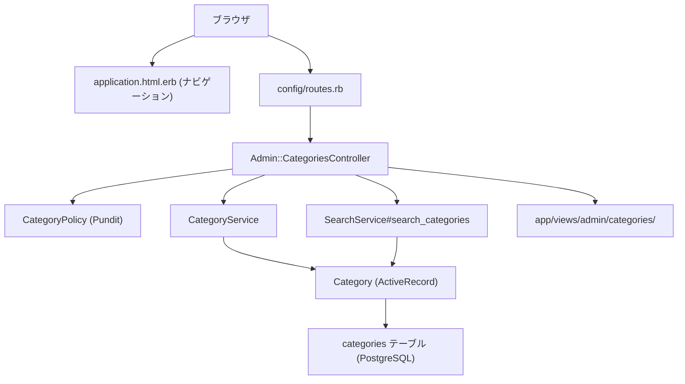

# 設計書: カテゴリCRUD機能

## Overview

本機能は、備品管理システムの管理者が備品カテゴリをブラウザから直接管理（一覧・作成・編集・削除）できるようにする。現状、`categories` テーブルはデータベースに存在するが、UI からの管理手段がない。

**Purpose**: 管理者がカテゴリのライフサイクルを完全に管理できる管理画面を提供する。
**Users**: 管理者（`admin` ロール）が備品分類の整理・追加・名称変更・廃止を行う。
**Impact**: 既存の `categories` テーブル・`Category` モデルに対して新たな管理 UI を追加する。データモデルの変更なし。

### Goals

- 管理者がカテゴリの CRUD 操作をブラウザで完結できること
- 備品一覧と同じ UX パターン（検索・ドロップダウンソート）を提供すること
- 備品が紐づくカテゴリを誤って削除しないよう保護すること
- 既存の `Admin` 名前空間・Service・Policy パターンを踏襲し、実装一貫性を維持すること

### Non-Goals

- 一般ユーザーへのカテゴリ管理権限付与
- カテゴリの階層化・ネスト構造
- カテゴリの並び順（表示順）の手動並べ替え
- バルクインポート / エクスポート

---

## Requirements Traceability

| Requirement | Summary | Components | Interfaces | Flows |
|-------------|---------|------------|------------|-------|
| 1.1–1.14 | カテゴリ一覧・検索・ソート | Admin::CategoriesController, SearchService, index view | search_categories | — |
| 2.1–2.4 | カテゴリ新規作成 | Admin::CategoriesController, CategoryService, new/form view | CategoryService#create | — |
| 3.1–3.4 | カテゴリ編集 | Admin::CategoriesController, CategoryService, edit/form view | CategoryService#update | — |
| 4.1–4.3 | カテゴリ削除（紐づき保護） | Admin::CategoriesController, CategoryService | CategoryService#destroy | — |
| 5.1–5.3 | アクセス制御・認可 | CategoryPolicy, ApplicationController (Pundit) | CategoryPolicy | — |
| 6.1–6.3 | ナビゲーション統合 | application.html.erb | — | — |

---

## Architecture

### Existing Architecture Analysis

- **Admin 名前空間**: `Admin::UsersController` / `Admin::DashboardsController` が存在し、`routes.rb` の `namespace :admin` ブロック内で定義されている
- **Service 層**: `UserService`, `EquipmentService` など Plain Ruby Object。`{ success:, record:, error:, message: }` ハッシュを返す規約
- **Policy 層**: Pundit。`ApplicationPolicy` を継承。管理者専用操作は全メソッドで `user.admin?` を返す
- **SearchService**: `EQUIPMENT_SORT_MAP` 定数 + `search_equipments` メソッドのパターンで実装済み。共通 `paginate` プライベートメソッドを持つ
- **View**: Tailwind CSS + ERB。`admin/users/` ビューのレイアウトを踏襲

### Architecture Pattern & Boundary Map



- **選択パターン**: Admin CRUD Extension — 既存 `Admin::UsersController` パターンを踏襲
- **新規境界**: `CategoryService`（削除保護ロジックの単体テスト可能化）、`CategoryPolicy`（認可の明示化）
- **SearchService 拡張**: 既存サービスに `CATEGORY_SORT_MAP` と `search_categories` を追加（新ファイル不要）

### Technology Stack

| Layer | Choice / Version | Role | Notes |
|-------|-----------------|------|-------|
| Frontend | Tailwind CSS + ERB | UI レンダリング | 既存スタイル踏襲 |
| Backend | Ruby on Rails 8.1 | MVC + ルーティング | 変更なし |
| 認可 | Pundit（既存） | アクセス制御 | CategoryPolicy を新規追加 |
| データ | PostgreSQL（既存） | categories テーブル | マイグレーション不要 |
| 検索・ソート | SearchService（既存拡張） | 検索・ページネーション | search_categories を追加 |

---

## Components and Interfaces

### コンポーネント一覧

| Component | Layer | Intent | Req Coverage | Key Dependencies | Contracts |
|-----------|-------|--------|--------------|------------------|-----------|
| Admin::CategoriesController | Controller | CRUD ルーティングと認可呼び出し | 1–6 | CategoryService (P0), CategoryPolicy (P0), SearchService (P0) | API |
| CategoryService | Service | カテゴリの作成・更新・削除ロジック | 2, 3, 4 | Category model (P0) | Service |
| CategoryPolicy | Policy | 管理者専用アクセス制御 | 5 | ApplicationPolicy (P0) | Service |
| SearchService (拡張) | Service | カテゴリ検索・ソート・ページネーション | 1 | Category model (P0) | Service |
| admin/categories/ views | View | 一覧・フォーム UI | 1–4, 6 | Admin::CategoriesController (P0) | — |
| application.html.erb (変更) | Layout | ナビゲーションリンク追加 | 6 | admin_categories_path (P0) | — |

---

### Controller 層

#### Admin::CategoriesController

| Field | Detail |
|-------|--------|
| Intent | カテゴリ CRUD の HTTP リクエストを受け付け、認可・サービス呼び出し・レスポンスを担う |
| Requirements | 1.1–1.14, 2.1–2.4, 3.1–3.4, 4.1–4.3, 5.1–5.3 |

**Responsibilities & Constraints**
- `ApplicationController` を継承（Devise 認証・Pundit 認可は ApplicationController に集約済み）
- 全アクションで `authorize` を呼び出す
- `index` は `SearchService#search_categories` に委譲し、`@categories`, `@pagination` をビューに渡す
- `create` / `update` / `destroy` は `CategoryService` に委譲し、結果ハッシュに応じてリダイレクト or 再描画

**Dependencies**
- Inbound: ブラウザ / Turbo — HTTP リクエスト (P0)
- Outbound: CategoryService — CRUD ロジック (P0)
- Outbound: SearchService — 検索・ソート・ページネーション (P0)
- Outbound: CategoryPolicy (via Pundit) — 認可 (P0)

**Contracts**: API [x] / Service [ ] / Event [ ] / Batch [ ] / State [ ]

##### API Contract

| Method | Path | Request Params | Response | Errors |
|--------|------|---------------|----------|--------|
| GET | /admin/categories | keyword, sort, page | index view | 403 (unauthorized) |
| GET | /admin/categories/new | — | new view | 403 |
| POST | /admin/categories | category[name] | redirect to index | 422 (validation), 403 |
| GET | /admin/categories/:id/edit | — | edit view | 404, 403 |
| PATCH | /admin/categories/:id | category[name] | redirect to index | 422, 404, 403 |
| DELETE | /admin/categories/:id | — | redirect to index | 403, 422 (has equipments) |

**Implementation Notes**
- Integration: `namespace :admin { resources :categories }` を `routes.rb` に追加
- Validation: Strong parameters で `params.require(:category).permit(:name)`
- Risks: なし（既存パターンの踏襲のみ）

---

### Service 層

#### CategoryService

| Field | Detail |
|-------|--------|
| Intent | カテゴリの作成・更新・削除に関するビジネスロジックを担い、統一ハッシュで結果を返す |
| Requirements | 2.1–2.4, 3.1–3.4, 4.1–4.3 |

**Responsibilities & Constraints**
- `create` / `update` / `destroy` の3メソッドを提供
- 戻り値は `{ success: Boolean, category: Category, error: Symbol, message: String }` の規約に従う
- `destroy` 時は `ActiveRecord::DeleteRestrictionError` を rescue し、備品紐づき時のエラーメッセージを返す

**Contracts**: Service [x]

##### Service Interface

```ruby
class CategoryService
  # @return [{ success: Boolean, category: Category }]
  def create(name:)

  # @return [{ success: Boolean, category: Category }]
  def update(category:, params:)

  # @return [{ success: Boolean }] or { success: false, error: :has_equipments, message: String }
  def destroy(category:)
end
```

- Preconditions: `name` は String
- Postconditions: `success: true` の場合、Category レコードが DB に反映されている
- Invariants: `destroy` は備品紐づき時に必ず `success: false` を返す（例外を再 raise しない）

**Implementation Notes**
- Integration: `has_many :equipments, dependent: :restrict_with_error` による例外を rescue
- Validation: モデルバリデーションに委譲（`presence: true`, `uniqueness: true`）
- Risks: `restrict_with_error` の例外クラスが Rails バージョンで変わる可能性 → `ActiveRecord::DeleteRestrictionError` を明示的に rescue

#### CategoryPolicy

| Field | Detail |
|-------|--------|
| Intent | カテゴリ管理の全アクションを管理者のみに制限する |
| Requirements | 5.1–5.3 |

**Contracts**: Service [x]

##### Service Interface

```ruby
class CategoryPolicy < ApplicationPolicy
  def index?   = user.admin?
  def new?     = user.admin?
  def create?  = user.admin?
  def edit?    = user.admin?
  def update?  = user.admin?
  def destroy? = user.admin?
end
```

**Implementation Notes**
- `ApplicationPolicy` の `initialize` が未認証時に `Pundit::NotAuthorizedError` を raise するため、未認証保護は自動で行われる

#### SearchService（拡張）

| Field | Detail |
|-------|--------|
| Intent | カテゴリ一覧の検索（名前部分一致）・ソート・ページネーションを提供する |
| Requirements | 1.1–1.14 |

**Contracts**: Service [x]

##### Service Interface

```ruby
CATEGORY_SORT_MAP = {
  "name"                   => "categories.name ASC",
  "name_desc"              => "categories.name DESC",
  "created_at"             => "categories.created_at DESC",
  "created_at_asc"         => "categories.created_at ASC",
  "equipments_count"       => "equipments_count DESC",
  "equipments_count_asc"   => "equipments_count ASC"
}.freeze

# @return [SearchResult]
def search_categories(keyword: nil, sort: nil, page: 1)
```

- Preconditions: `keyword` は String | nil, `sort` は CATEGORY_SORT_MAP のキー | nil
- Postconditions: `SearchResult` を返す（`records` に `equipments_count` 仮想カラムを含む）
- Invariants: `sort` が CATEGORY_SORT_MAP に存在しない場合は `created_at DESC` をデフォルトとする

**Implementation Notes**
- Integration: `left_joins(:equipments).group('categories.id').select('categories.*, COUNT(equipments.id) AS equipments_count')` でN+1を回避しつつ備品数をSQL集計
- Validation: ORDER 句は `CATEGORY_SORT_MAP` ホワイトリストのみ使用。`Arel.sql` で注入
- Risks: `equipments_count` 仮想カラムは SQL 集計結果のため、`ORDER BY equipments_count` の文字列を `Arel.sql` でラップすること

---

### View 層

#### admin/categories/ ビュー群

| View | 対応アクション | 概要 |
|------|--------------|------|
| index.html.erb | index | 検索フォーム（キーワード・ソートドロップダウン）+ テーブル + ページネーション |
| new.html.erb | new | フォームページ |
| edit.html.erb | edit | フォームページ |
| _form.html.erb | new/edit 共有 | カテゴリ名の入力フィールド + バリデーションエラー表示 |

**Implementation Notes**
- Integration: `admin/users/` ビューのレイアウト（Tailwind CSS クラス）を踏襲
- 検索フォームは `form_with url: admin_categories_path, method: :get` を使用
- ソートドロップダウンの選択肢: `["登録日（新しい順）", "created_at"]`, `["登録日（古い順）", "created_at_asc"]`, `["カテゴリ名（昇順）", "name"]`, `["カテゴリ名（降順）", "name_desc"]`, `["備品数（多い順）", "equipments_count"]`, `["備品数（少ない順）", "equipments_count_asc"]`
- 削除ボタンは `button_to` + `data: { turbo_confirm: "..." }` で確認ダイアログを表示
- リセットリンクは `link_to "リセット", admin_categories_path` で実装
- ナビゲーションのアクティブ判定: `controller_name == 'categories' && controller.class.module_parent == Admin`

---

## Data Models

### Domain Model

- **エンティティ**: `Category`（集約ルート）
- **関連**: `has_many :equipments`（1対多、削除制限付き）
- **不変条件**: カテゴリ名は必須・一意。備品紐づき時は削除不可。

### Logical Data Model

既存スキーマを変更なく利用する。

| カラム | 型 | 制約 |
|--------|-----|------|
| id | UUID | PK, DEFAULT gen_random_uuid() |
| name | string | NOT NULL, UNIQUE INDEX |
| created_at | datetime | NOT NULL |
| updated_at | datetime | NOT NULL |

**Referential Integrity**: `equipments.category_id` が `categories.id` を参照。`dependent: :restrict_with_error` によりカテゴリ削除時に備品が存在するとエラー。

---

## Error Handling

### Error Categories and Responses

**User Errors (4xx)**
- バリデーション失敗（名前空欄・重複）→ `422 Unprocessable Entity` + フォーム再描画 + エラーメッセージ表示
- 未認証アクセス → Devise がログイン画面へリダイレクト
- 権限なし（一般ユーザー）→ Pundit が `NotAuthorizedError` を raise → `ApplicationController#rescue_from` で 403 ページへ

**Business Logic Errors (422)**
- 備品紐づきカテゴリの削除 → `CategoryService#destroy` が `{ success: false, error: :has_equipments }` を返す → コントローラーが `alert` フラッシュ付きで一覧へリダイレクト

### Monitoring

既存の Rails ログ（`log/` ディレクトリ）に依存。特別なモニタリング追加なし。

---

## Testing Strategy

### Unit Tests (RSpec)

- `CategoryService#create`: 正常作成・名前空欄・名前重複
- `CategoryService#update`: 正常更新・バリデーションエラー
- `CategoryService#destroy`: 正常削除・備品紐づき時の削除拒否
- `CategoryPolicy`: 各アクションに対して管理者は許可、一般ユーザーは拒否
- `SearchService#search_categories`: キーワード検索・各ソートキー・ページネーション

### Integration Tests (RSpec / Request Specs)

- 管理者: index / new / create / edit / update / destroy の正常フロー
- 一般ユーザー: 各エンドポイントへのアクセスが 403 になること
- 未認証ユーザー: 各エンドポイントへのアクセスがログイン画面へリダイレクトされること
- 備品紐づきカテゴリの削除試行がエラーメッセージ付きリダイレクトになること

### E2E Tests（必要に応じて）

- 管理者ナビゲーションに「カテゴリ管理」リンクが表示されること
- 一般ユーザーのナビゲーションに「カテゴリ管理」リンクが表示されないこと

---

## Security Considerations

- **認可**: Pundit `CategoryPolicy` により管理者のみアクセス可能。未認証時は `ApplicationPolicy#initialize` が例外を raise
- **SQL インジェクション**: `CATEGORY_SORT_MAP` ホワイトリスト + `Arel.sql` によりソート句を安全に注入
- **Mass Assignment**: Strong Parameters で `name` のみ許可
