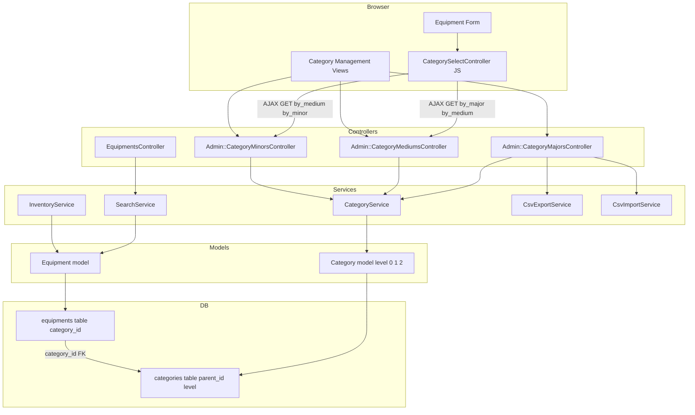
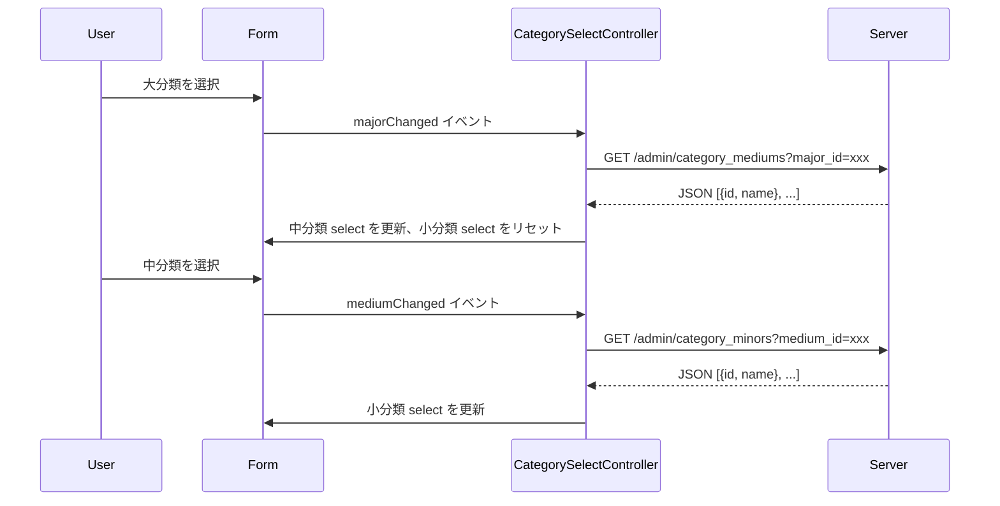
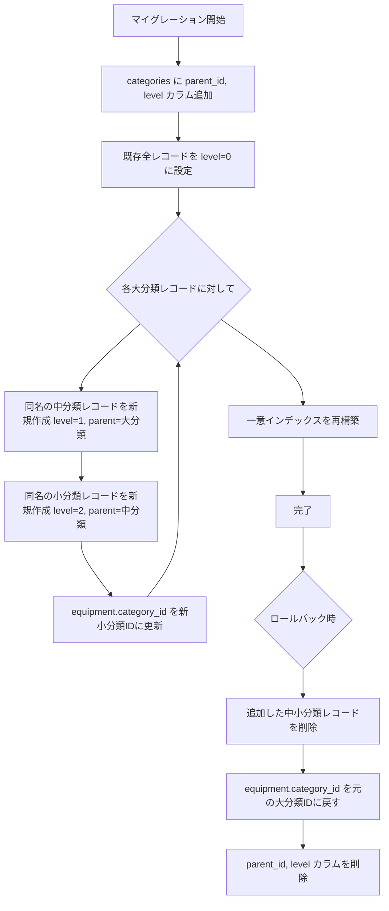
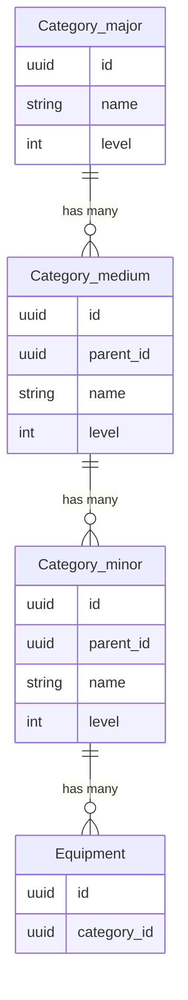
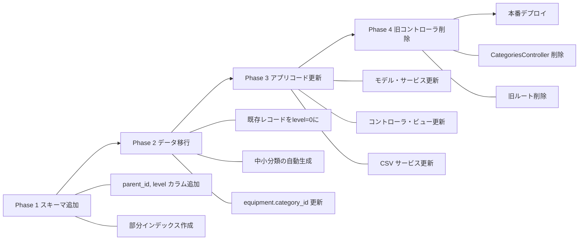

# Technical Design: category-hierarchy

## Overview

本機能は、備品管理システムの既存フラットカテゴリ（`Category`）を「大分類 → 中分類 → 小分類」の3段階階層へ拡張する。
`categories` テーブルに `parent_id` と `level` カラムを追加する self-referential アプローチを採用し、既存の `equipments.category_id` FK は変更しない。

**Purpose**: 備品分類の粒度を高め、管理者の運用整理と一般ユーザーの検索精度を向上させる。
**Users**: 管理者（カテゴリ階層の CRUD・CSV I/O）、一般ユーザー（階層フィルタによる備品検索）。
**Impact**: `categories` テーブルに `parent_id`・`level` を追加し、既存レコードをデータ移行により大分類（level=0）として昇格させる。備品の `category_id` は小分類（level=2）の ID を指すよう移行する。

### Goals

- `categories` テーブルの self-referential 拡張により3階層カテゴリを表現する
- 管理者が各階層を独立して CRUD 操作できる管理画面を提供する
- 備品フォームに3段階連動セレクト（大→中→小）を実装する
- 備品一覧の階層フィルタおよびダッシュボードの大分類別集計を対応させる
- 既存カテゴリデータをロールバック可能なマイグレーションで3階層に移行する
- CSV エクスポート・インポートを3カラム形式（大分類名/中分類名/小分類名）に対応させる

### Non-Goals

- 4階層以上への将来的な拡張（本設計は3層固定）
- カテゴリの並び順・表示順管理
- ユーザー側のカテゴリ自主登録
- Ancestry gem 等のサードパーティ階層ライブラリの導入

---

## Requirements Traceability

| Requirement | Summary | Components | Interfaces | Flows |
|-------------|---------|------------|------------|-------|
| 1.1〜1.6 | 3階層データモデル・親子制約・削除保護 | `Category`モデル、マイグレーション | `CategoryService` | — |
| 2.1〜2.6 | 管理者CRUD（大/中/小分類） | `Admin::CategoryMajors/Mediums/MinorsController`、Views | `CategoryService` | — |
| 3.1〜3.6 | 備品→小分類紐付け・連動セレクト | `EquipmentsController`、`Equipment`モデル、`CategorySelectController`(Stimulus) | JSON エンドポイント | 連動セレクトフロー |
| 4.1〜4.7 | 検索・フィルタ・ダッシュボード集計 | `SearchService`、`InventoryService` | `search_equipments` | — |
| 5.1〜5.5 | 既存データ移行・FK更新・ロールバック | マイグレーションファイル×2 | — | 移行フロー |
| 6.1〜6.6 | CSV I/O 3カラム対応 | `CsvExportService`、`CsvImportService`、`Admin::CategoryMajorsController` | CSV フォーマット | — |

---

## Architecture

### Existing Architecture Analysis

- `categories` テーブルは `id(UUID)`, `name(unique string)`, `timestamps` のみ
- `Equipment.belongs_to :category, optional: true` で単一フラット参照
- `Admin::CategoriesController` が単一コントローラとして CRUD + CSV を担当
- `SearchService#search_equipments` は `where(category_id:)` 単純フィルタ
- Stimulus は `controllers/` ディレクトリに `eagerLoadControllersFrom` で自動ロード済み

### Architecture Pattern & Boundary Map



**Architecture Integration**:
- 採用パターン: Self-referential Association（単一テーブル、`parent_id` + `level` による深さ管理）
- 既存の FK（`equipments.category_id → categories.id`）は変更しない。`level=2`（小分類）のみ備品に紐付けられるよう Model で制約
- Stimulus コントローラは AJAX で JSON エンドポイントを呼び出し、中分類・小分類のセレクトを動的更新
- Steering 規約準拠: Service Object パターン維持、Pundit Policy による認可、コントローラ薄型

### Technology Stack

| Layer | Choice / Version | Role in Feature | Notes |
|-------|-----------------|-----------------|-------|
| Backend | Rails 8.1.2 | Self-referential モデル、CRUD コントローラ | 既存スタック |
| Database | PostgreSQL（pgcrypto） | `parent_id uuid FK`, `level integer`, 部分インデックス | UNIQUE 制約を部分インデックスで実現（NULLs問題対応） |
| Frontend | Stimulus（Hotwire） | `CategorySelectController` による AJAX 連動セレクト | 追加 gem 不要 |
| Auth / Authz | Devise + Pundit | 既存 Policy を3階層モデルに拡張 | 既存スタック |
| CSV | Ruby標準 `csv` | 3カラム形式エクスポート・インポート | 既存スタック |

---

## System Flows

### 連動セレクト（備品フォーム）



### データ移行フロー



---

## Components and Interfaces

### コンポーネント概要

| Component | Domain/Layer | Intent | Req Coverage | Key Dependencies | Contracts |
|-----------|--------------|--------|--------------|-----------------|-----------|
| `Category` モデル | Model | 3階層のドメインオブジェクト | 1.1〜1.6 | — | Service |
| `CategoryService` | Service | 各階層の CRUD ロジック | 1.1〜1.6, 2.1〜2.6 | `Category` | Service |
| `Admin::CategoryMajorsController` | Controller | 大分類管理 + CSV I/O | 2.1〜2.6, 6.1〜6.6 | `CategoryService`, `CsvExportService`, `CsvImportService` | API, Service |
| `Admin::CategoryMediumsController` | Controller | 中分類管理 + AJAX JSON | 2.1〜2.6, 3.3〜3.4 | `CategoryService` | API, Service |
| `Admin::CategoryMinorsController` | Controller | 小分類管理 + AJAX JSON | 2.1〜2.6, 3.3〜3.4 | `CategoryService` | API, Service |
| `CategorySelectController`（Stimulus） | Frontend | 3段階連動セレクト UI | 3.2〜3.4 | JSON エンドポイント | State |
| `SearchService` | Service | 階層フィルタ付き備品検索 | 4.1〜4.6 | `Category`, `Equipment` | Service |
| `InventoryService` | Service | 大分類単位ダッシュボード集計 | 4.7 | `Category`, `Equipment` | Service |
| `CsvExportService` | Service | 3カラム CSV エクスポート | 6.1, 6.6 | `Category` | Batch |
| `CsvImportService` | Service | 3カラム CSV インポート | 6.2〜6.5 | `Category`, `CategoryService` | Batch |
| `CategoryPolicy` | Policy | Pundit 認可 | 2.6 | `User` | Service |
| マイグレーション×2 | DB | スキーマ変更・データ移行 | 1.1〜1.6, 5.1〜5.5 | — | — |

---

### Model Layer

#### `Category` モデル

| Field | Detail |
|-------|--------|
| Intent | 3階層カテゴリのドメインオブジェクト。`level` enum（major=0/medium=1/minor=2）と自己参照アソシエーションで階層を表現 |
| Requirements | 1.1, 1.2, 1.3, 1.4, 1.5, 1.6 |

**Responsibilities & Constraints**
- `level` enum による3段階の種別管理（major/medium/minor）
- `parent_id` による self-referential 親子関係（大分類は parent_id=NULL）
- 同一親内でのカテゴリ名一意性をモデルスコープバリデーションで保証
- 中分類の親は major レベルであること、小分類の親は medium レベルであることを model で検証
- 子カテゴリが存在する親の削除を `dependent: :restrict_with_error` で防止
- 小分類（level=2）のみ `has_many :equipments` で紐付け可能（モデルバリデーションで保護）

**Dependencies**
- Inbound: `CategoryService` — CRUD 操作（P0）
- Inbound: `SearchService`, `InventoryService` — 検索・集計クエリ（P1）
- Outbound: `Equipment` — 小分類参照（P1）

**Contracts**: Service [x]

##### Service Interface

```ruby
# app/models/category.rb
class Category < ApplicationRecord
  enum :level, { major: 0, medium: 1, minor: 2 }

  belongs_to :parent, class_name: "Category", optional: true
  has_many :children, class_name: "Category", foreign_key: :parent_id,
           dependent: :restrict_with_error
  has_many :equipments, dependent: :restrict_with_error  # level=2 のみ意味を持つ

  scope :major,  -> { where(level: :major) }
  scope :medium, -> { where(level: :medium) }
  scope :minor,  -> { where(level: :minor) }

  validates :name, presence: true
  validates :name, uniqueness: { scope: :parent_id, case_sensitive: false }
  validates :parent_id, presence: true, if: -> { medium? || minor? }
  validate :parent_level_consistency

  private

  def parent_level_consistency
    return unless parent
    if medium? && !parent.major?
      errors.add(:parent_id, "中分類の親は大分類でなければなりません")
    elsif minor? && !parent.medium?
      errors.add(:parent_id, "小分類の親は中分類でなければなりません")
    end
  end
end
```

- Preconditions: `level` は major/medium/minor の1つ。medium・minor は `parent_id` 必須
- Postconditions: 保存時に同一親スコープ内での name 一意性が保証される
- Invariants: 子が存在する場合の削除は `ActiveRecord::DeleteRestrictionError` を発生させる

**Implementation Notes**
- Integration: `equipment.category_id` は `categories.id` を参照し続ける。備品は小分類（level=2）を参照することが期待されるが、DB 制約ではなく Application レベルで保護
- Validation: `parent_level_consistency` バリデーションで深さ整合性を担保
- Risks: 既存テストの category ファクトリが `level: :major` デフォルトになるよう修正が必要

---

#### `Equipment` モデル（変更箇所）

| Field | Detail |
|-------|--------|
| Intent | `category_id` が小分類（level=2）のみを参照するよう Application レベルで制約する |
| Requirements | 3.1, 3.5 |

**Responsibilities & Constraints**
- `category_id` が設定されている場合、参照先カテゴリは `level == :minor` でなければならない
- `category_id` が NULL の場合（任意項目）はバリデーションをスキップする

##### Service Interface（追加バリデーションのみ）

```ruby
# app/models/equipment.rb への追加
validate :category_must_be_minor, if: -> { category_id.present? }

private

def category_must_be_minor
  unless category&.minor?
    errors.add(:category_id, "小分類（最下位カテゴリ）を選択してください")
  end
end
```

- Preconditions: `category_id` が存在する場合に限り検証
- Postconditions: 保存時に `category.level == :minor` が保証される
- Error message: "小分類（最下位カテゴリ）を選択してください"

**Implementation Notes**
- Integration: 備品フォームの連動セレクトで小分類まで選択が完了してから送信するため、通常フローでは このバリデーションは大分類・中分類の直接送信を防ぐ安全弁として機能する
- Risks: データ移行前（level カラム追加前）に既存テストが失敗しないよう、マイグレーション実行後にバリデーションを有効化する順序を遵守する

---

### Service Layer

#### `CategoryService`

| Field | Detail |
|-------|--------|
| Intent | 各階層カテゴリの CRUD ロジック。level と parent を受け取り、Category レコードを作成・更新・削除 |
| Requirements | 1.1〜1.6, 2.1〜2.6 |

**Responsibilities & Constraints**
- `create(name:, level:, parent_id:)` で指定レベルのカテゴリを生成
- `update(category:, params:)` でカテゴリを更新
- `destroy(category:)` で削除（子・備品が存在する場合はエラーを返す）

**Dependencies**
- Inbound: `Admin::Category{Majors,Mediums,Minors}Controller` — CRUD リクエスト（P0）
- Inbound: `CsvImportService` — バッチ作成（P1）
- Outbound: `Category` — ActiveRecord 操作（P0）

**Contracts**: Service [x]

##### Service Interface

```ruby
class CategoryService
  # @param name [String]
  # @param level [Symbol] :major | :medium | :minor
  # @param parent_id [String, nil] UUID。level=:major の場合は nil
  # @return [Hash] { success: Boolean, category: Category, error: Symbol, message: String }
  def create(name:, level:, parent_id: nil)

  # @param category [Category]
  # @param params [Hash] :name, :parent_id
  # @return [Hash] { success: Boolean, category: Category, error: Symbol, message: String }
  def update(category:, params:)

  # @param category [Category]
  # @return [Hash] { success: Boolean, error: Symbol, message: String }
  def destroy(category:)
end
```

- Preconditions: level は有効な enum 値。medium/minor は parent_id 必須
- Postconditions: success=true のとき Category は DB に永続化済み
- Error codes: `:validation_failed`, `:has_children`, `:has_equipments`

---

#### `SearchService`（変更箇所）

| Field | Detail |
|-------|--------|
| Intent | 大分類・中分類・小分類の各レベルでのフィルタをサポートする備品検索 |
| Requirements | 4.1〜4.6 |

##### Service Interface（変更箇所のみ）

```ruby
# @param category_major_id [String, nil]
# @param category_medium_id [String, nil]
# @param category_minor_id [String, nil]
# 上位フィルタ（major/medium）は配下の全備品を対象にする
def search_equipments(keyword: nil,
                      category_major_id: nil,
                      category_medium_id: nil,
                      category_minor_id: nil,
                      status: nil, sort: nil, page: 1)
```

フィルタSQL設計:
- `category_minor_id` 指定時: `WHERE equipments.category_id = :id`
- `category_medium_id` 指定時: `INNER JOIN categories minor ON ... WHERE minor.parent_id = :id`
- `category_major_id` 指定時: `INNER JOIN categories minor ... INNER JOIN categories medium ... WHERE medium.parent_id = :id`

---

#### `InventoryService`（変更箇所）

| Field | Detail |
|-------|--------|
| Intent | `dashboard_summary` を大分類（level=0）単位で集計するよう変更 |
| Requirements | 4.7 |

```ruby
# 変更前: group_by(&:category) → category.name でソート
# 変更後: minor→medium→major を辿り、major 単位で集計
def dashboard_summary
  # Equipment.kept.includes(category: { parent: :parent })
  # .group_by { |e| e.category&.parent&.parent }  # minor.parent.parent = major
end
```

---

#### `CsvExportService`（変更箇所）

| Field | Detail |
|-------|--------|
| Intent | カテゴリエクスポートを3カラム形式に変更し、備品CSVのカテゴリ列を階層パス形式に変更 |
| Requirements | 6.1, 6.6 |

##### Batch Contract

- `export_categories(categories)`: ヘッダ `%w[大分類名 中分類名 小分類名]`、各行に major→medium→minor のパスを展開（小分類レコードを入力とする）
- `export_equipments(equipments)`: カテゴリカラムを `"#{major.name} > #{medium.name} > #{minor.name}"` の階層パス形式に変更

---

#### `CsvImportService`（変更箇所）

| Field | Detail |
|-------|--------|
| Intent | カテゴリインポートを3カラム形式に変更し、大分類→中分類→小分類を upsert で処理 |
| Requirements | 6.2〜6.5 |

##### Batch Contract

- Input: `カテゴリ名,中分類名,小分類名` の3カラム CSV
  - 大分類・中分類が未存在の場合は新規作成（find_or_create_by）
  - 小分類は `[medium_id, name]` の組合せで一意判定
- `import_equipments` の変更: `カテゴリ名` カラムを `小分類名` → `中分類名` → `大分類名` の3カラムから解決するよう変更
- Idempotency: 既存の大/中/小分類レコードは再作成しない（find_or_create_by）

---

### Controller Layer

#### `Admin::CategoryMajorsController` / `Admin::CategoryMediumsController` / `Admin::CategoryMinorsController`

| Field | Detail |
|-------|--------|
| Intent | 各階層の CRUD、JSON エンドポイント（by_major/by_medium）、CSV I/O（大分類のみ） |
| Requirements | 2.1〜2.6, 3.3〜3.4, 6.1〜6.6 |

**Responsibilities & Constraints**
- `CategoryMajorsController`: 大分類 CRUD（index 含む） + CSV export/import (`export_csv`, `import_csv`, `import_template`)。`index` ページは大分類・中分類・小分類を3階層ツリービューとして一覧表示し、中分類・小分類の管理エントリポイントを兼ねる
- `CategoryMediumsController`: 中分類 CRUD（**index は除く**）+ `GET /by_major?major_id=xxx` → JSON `[{id:, name:}]`。一覧は `CategoryMajorsController#index` のツリービューで代替するため独立した index アクション・ビューは実装しない
- `CategoryMinorsController`: 小分類 CRUD（**index は除く**）+ `GET /by_medium?medium_id=xxx` → JSON `[{id:, name:}]`。一覧は同様にツリービューで代替するため独立した index アクション・ビューは実装しない
- すべて Pundit `authorize Category` で認可
- 既存 `Admin::CategoriesController` は削除し、ルートを新3コントローラに移行
- ルーティング: `resources :category_mediums, except: [:index]` / `resources :category_minors, except: [:index]`

##### API Contract

| Method | Endpoint | Request | Response | Errors |
|--------|----------|---------|----------|--------|
| GET | `/admin/category_mediums?major_id=:id` | query param | `[{id: UUID, name: String}]` | 200, 422 |
| GET | `/admin/category_minors?medium_id=:id` | query param | `[{id: UUID, name: String}]` | 200, 422 |

**Implementation Notes**
- Integration: `resources :category_majors`, `resources :category_mediums, except: [:index]`, `resources :category_minors, except: [:index]` をadmin名前空間内に追加
- 中分類・小分類の一覧ページは設けず、`admin_category_majors#index` のツリービュー（大→中→小を折り畳み表示）で代替する。これにより管理者は1画面で全階層を把握できる
- Risks: 既存の `admin_categories_path` ヘルパー参照を全ビューで新パスに置換する必要がある

---

### Frontend Layer

#### `CategorySelectController`（Stimulus）

| Field | Detail |
|-------|--------|
| Intent | 大分類選択→中分類取得→小分類取得の連動セレクト UI を管理する Stimulus コントローラ。「登録モード」と「検索モード」の2つの動作モードを持つ |
| Requirements | 3.2, 3.3, 3.4, 4.1〜4.5 |

**2つの動作モード**

| モード | 用途 | 小分類選択 | パラメータ送信 | 備考 |
|--------|------|-----------|--------------|------|
| **登録モード** | 備品登録・編集フォーム | 必須（小分類まで選ばないと送信不可） | `category_id`（小分類ID） | `Equipment#category_must_be_minor` バリデーションと連携 |
| **検索モード** | 備品一覧の検索フォーム | 任意（大/中/小 どの階層でも絞り込み可） | `category_major_id` / `category_medium_id` / `category_minor_id` のいずれか1つ | 上位選択時、下位セレクトはリセットするが送信を妨げない |

**Responsibilities & Constraints**
- `majorChange`: major select の変更を検知し `GET /admin/category_mediums?major_id=` を fetch してmedium selectを更新
- `mediumChange`: medium select の変更を検知し `GET /admin/category_minors?medium_id=` を fetch してminor selectを更新
- 登録モード: minor が未選択の場合は submit ボタンを disabled にする（または `category_must_be_minor` バリデーションに委ねる）
- 検索モード: `mode: "search"` value が設定されている場合、いずれかの階層選択で即時検索可能
- 初期値: ページロード時に `selectedMajor/Medium/Minor` values でセレクトの初期状態を設定（備品編集時）

##### State Management

```javascript
// app/javascript/controllers/category_select_controller.js
export default class extends Controller {
  static targets = ["major", "medium", "minor"]
  static values  = {
    mediumsUrl: String,   // "/admin/category_mediums"
    minorsUrl:  String,   // "/admin/category_minors"
    mode:       String,   // "form"（デフォルト） or "search"
    selectedMajor:  String,
    selectedMedium: String,
    selectedMinor:  String
  }
  // majorChange(): fetch mediums → rebuild medium select → clear minor select
  //   → 検索モードの場合: minor/medium パラメータを送信なしでフォーム送信可能
  // mediumChange(): fetch minors → rebuild minor select
  //   → 検索モードの場合: minor パラメータを送信なしでフォーム送信可能
}
```

**検索フォームのパラメータ設計（`equipments/index.html.erb` + `SearchService`）**:
- 大分類のみ選択 → `?category_major_id=:id` を送信 → SearchService が配下の全備品を返す
- 中分類のみ選択 → `?category_medium_id=:id` を送信 → SearchService が配下の全備品を返す
- 小分類まで選択 → `?category_minor_id=:id` を送信 → SearchService がその小分類の備品のみ返す
- 既存 `?category_id=` パラメータは廃止し新3パラメータに移行

- State model: AJAX fetch → `<option>` タグを innerHTML で再構築
- Concurrency: fetch はシリアルに実行（中分類取得完了後に小分類取得）
- Persistence: 選択値は `<select>` の `value` として維持

**Implementation Notes**
- Integration: 登録フォーム（`equipments/_form.html.erb`）は `data-category-select-mode-value="form"`、検索フォーム（`equipments/index.html.erb`）は `data-category-select-mode-value="search"` を付与して動作を切り替える
- Validation: JavaScript 無効環境では3つのセレクトが独立して表示される（登録モードでは `category_must_be_minor` バリデーションがサーバーサイドで保護）
- Risks: 既存備品の編集時は `@category_minor`, `@category_medium`, `@category_major` をコントローラが設定し `selectedMajor/Medium/Minor` values として渡す

---

## Data Models

### Domain Model

- **大分類（Category level=0）**: 最上位集約ルート。子に中分類を持つ。名前はグローバル一意
- **中分類（Category level=1）**: 大分類に従属。子に小分類を持つ。名前は同一親内で一意
- **小分類（Category level=2）**: 末端エンティティ。複数の Equipment から参照される。名前は同一親内で一意
- **Equipment**: 小分類との関連 `belongs_to :category`（category は level=2 であることが期待される）

### Logical Data Model



> 物理的には上記は全て `categories` テーブルの `level` 値の違いで表現される（self-referential）

### Physical Data Model

**マイグレーション1: スキーマ変更（`add_category_hierarchy_to_categories`）**

```sql
-- categories テーブルに追加
ALTER TABLE categories ADD COLUMN parent_id UUID REFERENCES categories(id);
ALTER TABLE categories ADD COLUMN level INTEGER NOT NULL DEFAULT 0;

-- 既存のグローバル UNIQUE インデックスを削除
DROP INDEX index_categories_on_name;

-- 大分類（level=0）用: グローバル一意
CREATE UNIQUE INDEX idx_categories_name_root
  ON categories (name)
  WHERE parent_id IS NULL;

-- 中分類・小分類用: 親スコープ内で一意
CREATE UNIQUE INDEX idx_categories_name_scoped
  ON categories (parent_id, name)
  WHERE parent_id IS NOT NULL;

-- parent_id インデックス
CREATE INDEX idx_categories_parent_id ON categories (parent_id);
```

**マイグレーション2: データ移行（`migrate_categories_to_hierarchy`）**

マーキング方式によりロールバック安全性を保証する。移行で自動生成した中分類・小分類には `migrated_from_flat: true` フラグを付与し、`down` メソッドでそのフラグで識別・削除する。

```sql
-- categories テーブルに移行マーカーカラムを追加（マイグレーション1 に含める）
ALTER TABLE categories ADD COLUMN migrated_from_flat BOOLEAN NOT NULL DEFAULT FALSE;

-- Rubyコードで実施（概要）:
-- 1. 既存全レコードを level=0（大分類）に設定（level カラムデフォルト0のため変更不要）
-- 2. 各大分類レコードに対して:
--    a. 中分類を INSERT (level=1, parent=大分類, name=大分類.name, migrated_from_flat=true)
--    b. 小分類を INSERT (level=2, parent=中分類, name=大分類.name, migrated_from_flat=true)
--    c. equipment.category_id を当該小分類のIDに UPDATE（元のIDを別テーブルや配列に退避）
-- 3. equipment の旧 category_id → 新小分類 ID のマッピングを categories の
--    temporary_original_id カラム（VARCHAR）に保持（rollback 用）

-- ロールバック（down メソッド）:
-- 1. migrated_from_flat=true の小分類に紐づく equipment.category_id を
--    当該小分類の parent.parent（大分類）IDに戻す
-- 2. Category.where(migrated_from_flat: true).delete_all（中・小分類のみ削除）
-- 3. 大分類は level=0 のまま維持（データは保持）
```

> ロールバック後の状態: 既存の大分類レコードのみが残り、備品の `category_id` は大分類IDに戻る。これはマイグレーション前と同等の状態（フラット構造）を復元する。

**追加カラム（マイグレーション1 に含める）**:
- `migrated_from_flat BOOLEAN NOT NULL DEFAULT FALSE` — 移行自動生成レコードの識別フラグ。ロールバック時に `WHERE migrated_from_flat = TRUE` で絞り込んで削除する

**Indexes**:
- `idx_categories_name_root`: 大分類のグローバル name 一意性
- `idx_categories_name_scoped`: 中小分類の親スコープ内 name 一意性
- `idx_categories_parent_id`: 子カテゴリ取得の高速化
- `index_equipments_on_category_id`: 既存（変更なし）

### Data Contracts & Integration

**カテゴリ CSV フォーマット（3カラム）**

```
大分類名,中分類名,小分類名
PC・周辺機器,ノートPC,ThinkPad
PC・周辺機器,ノートPC,MacBook
PC・周辺機器,デスクトップPC,iMac
```

- インポート: 大分類→中分類→小分類の順に `find_or_create_by` で処理
- エクスポート: `Category.minor.includes(parent: :parent)` で小分類を起点に3列を展開

---

## Error Handling

### Error Strategy

- バリデーションエラーはフォームに `422 Unprocessable Entity` でフィードバック（既存パターン踏襲）
- 削除制約エラー（子・備品が存在）は `flash[:alert]` で表示し一覧ページへリダイレクト
- AJAX エンドポイント（by_major/by_medium）は `200 OK` + JSON または `422` + エラーメッセージ

### Error Categories and Responses

**User Errors (4xx)**:
- `parent_level_consistency` バリデーション失敗 → フォームエラー表示
- 同一親内の name 重複 → `422` + フォームエラー

**Business Logic Errors (422)**:
- 子カテゴリが存在する親の削除 → `flash[:alert]: "このカテゴリには子カテゴリが登録されているため削除できません"`
- 備品が存在する小分類の削除 → `flash[:alert]: "このカテゴリには備品が登録されているため削除できません"`

**CSV Import Errors**:
- 3カラム形式不正 → 行番号付きエラーリストを `flash[:import_errors]` で表示

---

## Testing Strategy

### Unit Tests

- `spec/models/category_spec.rb`: level enum、parent_level_consistency バリデーション、名前一意性（スコープ）、削除制約
- `spec/services/category_service_spec.rb`: `create` の各 level、`destroy` の子・備品存在時エラー
- `spec/services/search_service_spec.rb`: major/medium/minor フィルタによる備品絞り込み
- `spec/services/csv_export_service_spec.rb`: 3カラム形式・階層パス形式の出力
- `spec/services/csv_import_service_spec.rb`: 3カラムインポート・upsert ロジック・バリデーションエラー

### Integration Tests

- `spec/requests/admin/category_majors_spec.rb` / `category_mediums_spec.rb` / `category_minors_spec.rb`: CRUD + JSON エンドポイント（index は `category_majors` のみテスト対象。`category_mediums` / `category_minors` に独立した index は存在しない）
- `spec/integration/category_hierarchy_spec.rb`: 大→中→小の作成→備品登録→検索→削除フロー
- マイグレーションテスト: 既存 categories データを使ったデータ移行の整合性検証

### E2E Tests

- 備品フォームの3段階連動セレクト（Capybara + Selenium）— `spec/system/equipment_category_select_spec.rb`（未実装・保留）
- 大分類フィルタで配下の全備品が表示されること

---

## Security Considerations

- Pundit `CategoryPolicy` を既存パターンに合わせて拡張（admin のみ CRUD、全ユーザーは JSON エンドポイント読み取り可）
- JSON エンドポイント（`by_major`, `by_medium`）は認証済みユーザーなら参照可能（`before_action :authenticate_user!` 適用済み）
- CSV インポートのフォーミュラインジェクション対策は既存 `escape_formula` を3カラムに適用

---

## Migration Strategy



- **ロールバック（マーキング方式）**: `migrated_from_flat: true` で識別した中小分類レコードのみを削除し、`equipment.category_id` を大分類IDに戻す。ユーザーが移行後に手動作成したカテゴリ（`migrated_from_flat: false`）は削除しない。マイグレーション1の `down` で `migrated_from_flat` カラムも削除
- **検証チェックポイント**: データ移行後に `Equipment.kept.where(category_id: Category.minor.select(:id)).count == Equipment.kept.count` を確認
