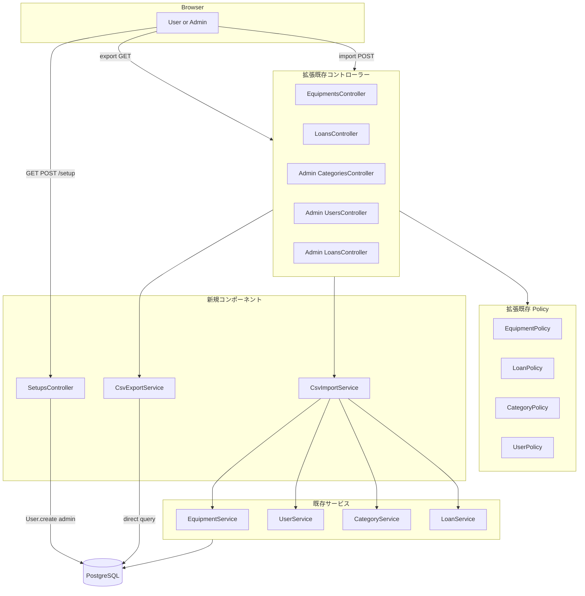
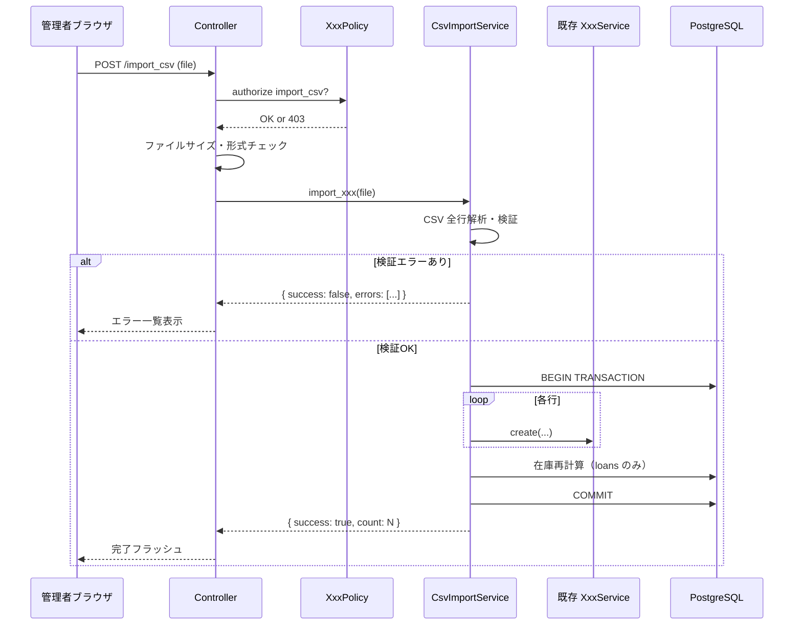
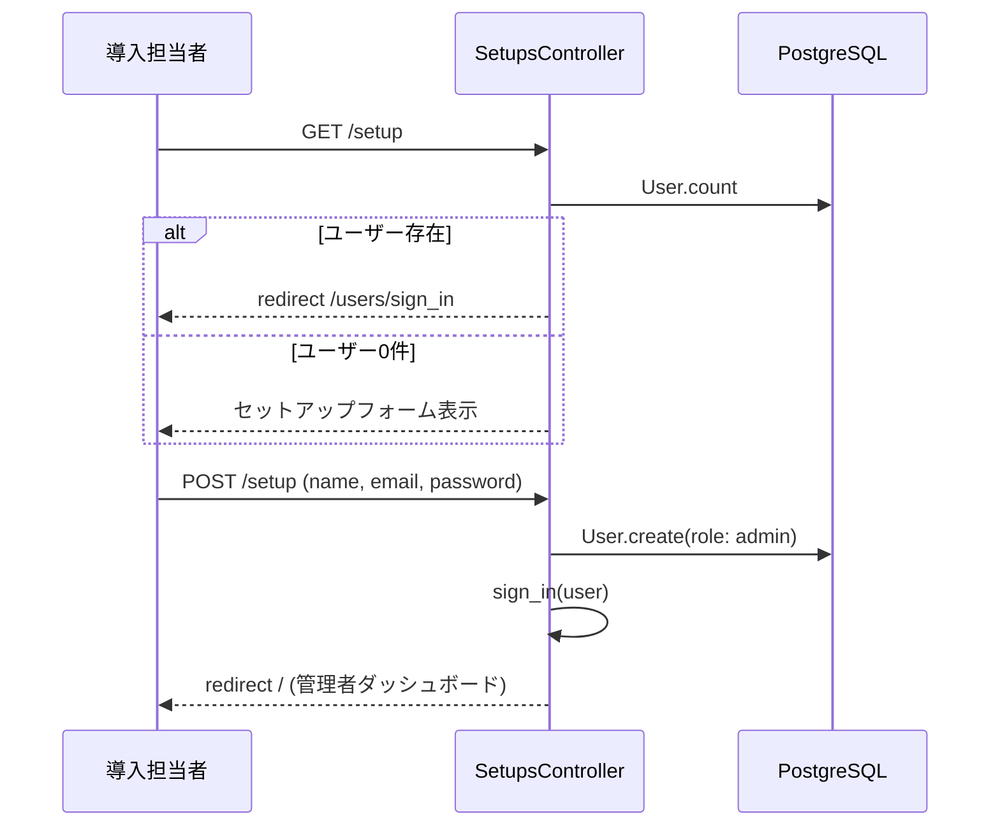

# Design Document: csv-io

## Overview

本機能は、備品管理システムに CSV エクスポート・インポート機能と初期管理者作成画面を追加する。既存の Service Object・Pundit Policy パターンを踏襲し、DB スキーマ変更なしで実現する。

**Purpose**: Render 無料プランの 90 日 DB リセット環境で UI のみによるデータ移行を完結させる。日常運用においても外部ツールとのデータ連携・監査を効率化する。
**Users**: 管理者（全エンティティのエクスポート・インポート）、一般ユーザー（備品一覧・自身の貸出履歴のエクスポートのみ）。
**Impact**: 新規 Service 2 クラス・`SetupsController` を追加し、既存コントローラー・Policy に CSV アクションを拡張する。既存 DB スキーマ変更なし。

### Goals

- カテゴリ → ユーザー → 備品 → 貸出履歴の順序で UI のみのデータ移行を完結させる
- All-or-nothing インポートでデータ整合性を保証する
- 既存の Service Object・Pundit・Admin 名前空間パターンを踏襲する

### Non-Goals

- CSV カラムのカスタマイズ UI
- 非同期インポート（ActiveJob 経由）
- `.xlsx` 形式のサポート
- `available_count` の CSV 上書きインポート（貸出履歴から自動再計算）

---

## Architecture

### Existing Architecture Analysis

- **Service Object パターン**: ビジネスロジックは `XxxService` クラスに集約。戻り値は `{ success: Boolean, ... }` ハッシュ。
- **Pundit Policy**: コントローラーで `authorize @record`（または `authorize Model`）を呼び、`XxxPolicy#action?` で権限判定。
- **Admin 名前空間**: 管理者専用機能は `Admin::XxxController` + `namespace :admin` ルートに分離。
- **既存コントローラー**: `EquipmentsController`、`LoansController` は認証ユーザー全体向け。`Admin::` 配下は管理者専用。

### Architecture Pattern & Boundary Map



**Architecture Integration**:
- 選択パターン: 既存 MVC + Service + Policy への拡張（Extension）
- 新規境界: `CsvExportService`（クエリ結果 → CSV 変換）、`CsvImportService`（CSV → 既存 Service 呼び出し）、`SetupsController`（認証前アクセス可能）
- 保持する既存パターン: Service Object 戻り値形式、Pundit `authorize` 呼び出し、Admin 名前空間
- Steering 準拠: Fat Controller 回避（CSV ロジックは Service に集約）、コントローラーは薄く保つ

### Technology Stack

| Layer | 選択 | 役割 | Notes |
|-------|------|------|-------|
| Backend | Ruby 標準 `csv` ライブラリ | CSV 生成・解析 | 追加 gem 不要 |
| Backend | Rails `send_data` | CSV ファイルダウンロード | Content-Type: text/csv |
| Backend | `ActionDispatch::Http::UploadedFile` | アップロードファイル受信 | `file.read` で内容取得 |
| Backend | Pundit（既存） | CSV アクションの認可 | Policy に csv アクション追加 |
| Data | PostgreSQL（既存） | 全データ永続化 | スキーマ変更なし |

---

## System Flows

### インポートフロー（全エンティティ共通）



### `/setup` フロー



---

## Requirements Traceability

| Requirement | Summary | Components | Interfaces |
|-------------|---------|------------|------------|
| 1 | 備品一覧 CSV エクスポート | `EquipmentsController`, `CsvExportService`, `EquipmentPolicy` | `export_equipments(relation)` |
| 2 | 貸出履歴 CSV エクスポート | `LoansController`, `CsvExportService`, `LoanPolicy` | `export_loans(relation)` |
| 3 | 備品 CSV インポート | `EquipmentsController`, `CsvImportService`, `EquipmentPolicy` | `import_equipments(file)` |
| 4 | 貸出履歴 CSV インポート | `Admin::LoansController`, `CsvImportService` | `import_loans(file)` |
| 5 | 認可・アクセス制御 | 全 Policy（csv アクション拡張） | `export_csv?`, `import_csv?` |
| 6 | ユーザー一覧 CSV エクスポート | `Admin::UsersController`, `CsvExportService`, `UserPolicy` | `export_users` |
| 7 | 初期管理者作成画面 | `SetupsController` | `new`, `create` |
| 8 | カテゴリ CSV エクスポート・インポート | `Admin::CategoriesController`, `CsvExportService`, `CsvImportService` | `export_categories`, `import_categories(file)` |
| 9 | ユーザー一括 CSV インポート | `Admin::UsersController`, `CsvImportService` | `import_users(file)` |
| 10 | 移行順序保証と在庫再計算 | `CsvImportService`, `Admin::LoansController` | `recalculate_available_counts` |

---

## Components and Interfaces

### コンポーネント一覧

| Component | Layer | Intent | Req Coverage | Key Dependencies |
|-----------|-------|--------|--------------|-----------------|
| `CsvExportService` | Service | クエリ結果を UTF-8 BOM 付き CSV 文字列に変換 | 1, 2, 6, 8 | ActiveRecord モデル (P0) |
| `CsvImportService` | Service | CSV ファイルを解析し既存 Service 経由で一括登録 | 3, 4, 8, 9, 10 | EquipmentService, UserService, CategoryService, LoanService (P0) |
| `SetupsController` | Controller | ユーザー0件時の初期管理者作成 | 7 | User モデル (P0), Devise sign_in (P0) |
| `EquipmentPolicy` 拡張 | Policy | CSV アクションの認可 | 5 | 既存 ApplicationPolicy (P0) |
| `LoanPolicy` 拡張 | Policy | CSV エクスポート・インポートの認可 | 5 | 既存 ApplicationPolicy (P0) |
| `CategoryPolicy` 拡張 | Policy | CSV エクスポート・インポートの認可 | 5 | 既存 ApplicationPolicy (P0) |
| `UserPolicy` 拡張 | Policy | CSV エクスポート・インポートの認可 | 5 | 既存 ApplicationPolicy (P0) |
| Route 拡張 | Routing | CSV アクション・setup エンドポイントの追加 | 全体 | — |

---

### Service 層

#### CsvExportService

| Field | Detail |
|-------|--------|
| Intent | ActiveRecord リレーションまたはモデルから UTF-8 BOM 付き CSV 文字列を生成する |
| Requirements | 1, 2, 6, 8 |

**Responsibilities & Constraints**
- 各エンティティ固有のカラム定義を保持し、CSV ヘッダーと値を生成する
- 検索フィルタ適用済みのリレーションを受け取るため、クエリロジックは持たない
- ソフトデリート済みレコードの除外はリレーション側（呼び出し元コントローラー）で処理済みであることを前提とする

**Dependencies**
- Inbound: 各コントローラー — クエリ済みリレーションを渡す (P0)
- External: Ruby 標準 `csv` ライブラリ (P0)

**Contracts**: Service [x]

##### Service Interface

```ruby
class CsvExportService
  # @param equipments [ActiveRecord::Relation<Equipment>]
  # @return [String] UTF-8 BOM 付き CSV 文字列
  def export_equipments(equipments)

  # @param loans [ActiveRecord::Relation<Loan>]
  # @return [String]
  def export_loans(loans)

  # @param categories [ActiveRecord::Relation<Category>]
  # @return [String]
  def export_categories(categories)

  # @param users [ActiveRecord::Relation<User>]
  # @return [String]
  def export_users(users)

  private

  # @return [String] "\xEF\xBB\xBF" + CSV.generate(...)
  def generate_csv(headers, rows)
end
```

- Preconditions: 引数のリレーションは呼び出し元でフィルタ・認可済みであること
- Postconditions: 文字コード UTF-8 BOM 付き、ヘッダー行あり CSV 文字列を返す
- Invariants: パスワードハッシュ等の認証情報を出力しない（ユーザー CSV）

**Implementation Notes**
- Integration: `send_data(csv, filename: "equipments_#{Date.today.strftime('%Y%m%d')}.csv", type: "text/csv; charset=utf-8")` でダウンロード
- Risks: 大量レコード（数万件）での同期処理タイムアウト。5MB インポート制限により一定の歯止めあり

---

#### CsvImportService

| Field | Detail |
|-------|--------|
| Intent | CSV ファイルを全行検証し、エラーなしの場合のみトランザクション内で一括登録する |
| Requirements | 3, 4, 8, 9, 10 |

**Responsibilities & Constraints**
- 全行を事前検証し、エラーがあれば `{ success: false, errors: [...] }` を返してロールバック（部分インポートなし）
- 既存 Service（`EquipmentService` 等）を経由してレコードを登録し、バリデーションを再利用する
- 貸出履歴インポート完了後に `recalculate_available_counts` を呼び在庫数を再計算する

**Dependencies**
- Inbound: 各コントローラー — `ActionDispatch::Http::UploadedFile` (P0)
- Outbound: `EquipmentService#create`, `UserService#create`, `CategoryService#create`, `LoanService` (P0)
- External: Ruby 標準 `csv` ライブラリ (P0)

**Contracts**: Service [x]

##### Service Interface

```ruby
class CsvImportService
  # @param file [ActionDispatch::Http::UploadedFile]
  # @return [Hash] { success: Boolean, count: Integer,
  #                  errors: Array<{ row: Integer, message: String }>,
  #                  message: String }
  def import_categories(file)
  def import_users(file)
  def import_equipments(file)

  # @param file [ActionDispatch::Http::UploadedFile]
  # @return [Hash] { success: Boolean, count: Integer,
  #                  errors: Array<{ row: Integer, message: String }>,
  #                  recalculated_count: Integer,
  #                  warnings: Array<String>,
  #                  message: String }
  def import_loans(file)

  private

  # 貸出履歴インポート後に各備品の available_count を再計算する
  # available_count = total_count - active/overdue loans の件数
  # @return [{ updated: Integer, warnings: Array<String> }]
  def recalculate_available_counts

  # @param file [ActionDispatch::Http::UploadedFile]
  # @return [Boolean]
  def csv_file?(file)
end
```

- Preconditions: ファイルサイズ（5MB 以下）と形式（CSV）はコントローラー側で検証済み
- Postconditions: 成功時は全行が単一トランザクション内で登録済み。失敗時はロールバック済み
- Invariants: `import_users` で登録されるユーザーの初期パスワードは `password123` に固定

---

### Controller 層

#### SetupsController（新規）

| Field | Detail |
|-------|--------|
| Intent | ユーザー0件時のみアクセス可能な初期管理者作成画面を提供する |
| Requirements | 7 |

**Responsibilities & Constraints**
- `ApplicationController` を継承しつつ `skip_before_action :authenticate_user!` を適用
- `before_action :redirect_if_users_exist` で既存ユーザーが1件でも存在する場合は `/users/sign_in` へリダイレクト
- Pundit `authorize` は適用しない（認証前アクセスが前提）

**Contracts**: API [x]

##### API Contract

| Method | Endpoint | Request | Response | Errors |
|--------|----------|---------|----------|--------|
| GET | /setup | — | セットアップフォーム HTML | — |
| POST | /setup | `name, email, password, password_confirmation` | redirect `/` | 422（バリデーションエラー） |

**Implementation Notes**
- Integration: 作成成功後に `sign_in(user)` で Devise セッションを確立し root_path へリダイレクト
- Validation: User モデルの Devise バリデーション（email ユニーク・パスワード 8 文字以上）に委ねる

---

#### 既存コントローラー拡張（CSV アクション追加）

各コントローラーに以下のアクションを追加する。既存の認証・認可フローはそのまま継承する。

| コントローラー | 追加アクション | 認可メソッド |
|--------------|-------------|-------------|
| `EquipmentsController` | `export_csv` (GET collection), `import_csv` (POST collection), `import_template` (GET collection) | `authorize Equipment, :export_csv?` / `:import_csv?` |
| `LoansController` | `export_csv` (GET collection) | `authorize Loan, :export_csv?` |
| `Admin::CategoriesController` | `export_csv` (GET), `import_csv` (POST), `import_template` (GET) | `authorize Category, :export_csv?` / `:import_csv?` |
| `Admin::UsersController` | `export_csv` (GET), `import_csv` (POST), `import_template` (GET) | `authorize User, :export_csv?` / `:import_csv?` |
| `Admin::LoansController` | `import_csv` (POST), `import_template` (GET) | `authorize Loan, :import_csv?` |

---

### Policy 層（拡張）

既存の各 Policy に `export_csv?` と `import_csv?` メソッドを追加する。

```ruby
# EquipmentPolicy
def export_csv? = true           # 全認証ユーザー
def import_csv? = user.admin?

# LoanPolicy
def export_csv? = true           # 全認証ユーザー（データスコープはコントローラーで制御）
def import_csv? = user.admin?

# CategoryPolicy
def export_csv? = user.admin?
def import_csv? = user.admin?

# UserPolicy
def export_csv? = user.admin?
def import_csv? = user.admin?
```

---

### Route 拡張

```ruby
# 既存ルートに collection アクションを追加
resources :equipments do
  collection do
    get  :export_csv
    get  :import_template
    post :import_csv
  end
end

resources :loans, only: [:index, :new, :create] do
  collection { get :export_csv }
  member do
    patch :approve
    patch "return", action: :return_loan, as: :return
  end
end

namespace :admin do
  resource :dashboard, only: :show
  resources :users do
    collection { get :export_csv; get :import_template; post :import_csv }
  end
  resources :categories do
    collection { get :export_csv; get :import_template; post :import_csv }
  end
  resources :loans, only: [:new, :create] do
    collection { get :import_template; post :import_csv }
  end
end

# 新規エンドポイント（認証前アクセス可能）
get  "/setup", to: "setups#new",    as: :setup
post "/setup", to: "setups#create"
```

---

## Data Models

### Domain Model

既存モデルに変更なし。CSV はモデルの既存フィールドのみを対象とする。

### CSV データコントラクト

#### 備品エクスポート / インポート CSV スキーマ

| カラム名 | 型 | 必須 | 備考 |
|---------|-----|------|------|
| `name` | String | ✅ | 備品名 |
| `management_number` | String | ✅ | 管理番号（一意） |
| `category_name` | String | — | カテゴリ名（インポート時は DB に存在するカテゴリ名で参照） |
| `status` | String | — | `available` / `in_use` / `repair` / `disposed`（省略時 `available`） |
| `total_count` | Integer | ✅ | 総数 |
| `low_stock_threshold` | Integer | — | 省略時 1 |
| `description` | String | — | 説明 |

> インポート時 `available_count` は指定不可。`total_count` と同値で登録後、貸出履歴インポートで再計算する。

#### ユーザーエクスポート / インポート CSV スキーマ

| カラム名 | 型 | 必須 | 備考 |
|---------|-----|------|------|
| `name` | String | ✅ | 氏名 |
| `email` | String | ✅ | メールアドレス（一意） |
| `role` | String | — | `admin` / `member`（省略時 `member`） |
| `created_at` | DateTime | — | エクスポート時のみ出力。インポート時は無視 |

> インポート時のパスワードは `password123` 固定。

#### カテゴリエクスポート / インポート CSV スキーマ

| カラム名 | 型 | 必須 | 備考 |
|---------|-----|------|------|
| `name` | String | ✅ | カテゴリ名（一意） |

#### 貸出履歴エクスポート / インポート CSV スキーマ

| カラム名 | 型 | 必須 | 備考 |
|---------|-----|------|------|
| `equipment_management_number` | String | ✅ | 備品の管理番号で参照 |
| `user_email` | String | ✅ | ユーザーのメールアドレスで参照 |
| `status` | String | ✅ | `pending_approval` / `active` / `returned` / `overdue` |
| `start_date` | Date | ✅ | `YYYY-MM-DD` 形式 |
| `expected_return_date` | Date | ✅ | `YYYY-MM-DD` 形式 |
| `actual_return_date` | Date | — | `returned` ステータスの場合は必須 |

---

## Error Handling

### Error Strategy

- **インポートエラー**: 全行を検証してからトランザクションを開始。エラーがあれば `errors` 配列を返しコントローラーでビューに渡す
- **ファイル形式エラー**: コントローラー層で早期リターン
- **認可エラー**: Pundit の `rescue_from Pundit::NotAuthorizedError` で ApplicationController で一元処理（既存）

### Error Categories and Responses

**インポートバリデーションエラー（422）**:
- 行番号・カラム名・理由を `errors: [{ row: 2, message: "カテゴリ名 'PC' が存在しません" }]` 形式で返す
- ビューでエラー一覧テーブルを表示する

**ファイル形式エラー（400 相当）**:
- `flash[:alert]` でメッセージを表示しリダイレクト

**在庫不整合警告（警告のみ・処理は完了）**:
- `available_count > total_count` が発生した備品名を `warnings` 配列で返す
- フラッシュメッセージで警告として表示（エラーではない）

---

## Testing Strategy

- **Unit Tests（Service）**:
  - `CsvExportService`: 各エンティティの CSV ヘッダー・値・BOM 付与を検証
  - `CsvImportService`: 正常インポート・バリデーションエラー・ロールバック・在庫再計算を検証

- **Unit Tests（Policy）**:
  - 各 Policy の `export_csv?` / `import_csv?` を admin / member で検証

- **Integration Tests（Request）**:
  - エクスポート: `Content-Type: text/csv` のレスポンス・ファイル名・行数を検証
  - インポート: 正常完了時のレコード数・エラー時のロールバック・管理者専用アクセス制限を検証
  - `/setup`: ユーザー0件時のフォーム表示・作成後のリダイレクト・既存ユーザー存在時のリダイレクトを検証

- **Integration Tests（Migration Flow）**:
  - カテゴリ → ユーザー → 備品 → 貸出履歴の順インポートで在庫数整合性を検証

---

## Security Considerations

- **インポートファイルの検証**: MIME タイプと拡張子の両方を確認。CSV 内容のコードインジェクション対策として ActiveRecord バリデーションに委ねる（直接 SQL 実行なし）
- **パスワード CSV 除外**: `CsvExportService#export_users` は `encrypted_password` を含めない
- **仮パスワード通知**: `import_users` 完了時のフラッシュに初期パスワード `password123` を明示し、即時変更を促す
- **/setup 公開エンドポイント**: `User.count > 0` のガードで本番運用中の悪用を防止

---

## Migration Strategy

Render 無料プランでの DB リセット後の推奨移行フロー：


- **手順 1**: 旧 DB が有効な間に全エンティティを CSV エクスポート
- **手順 3**: `/setup` から管理者アカウントを作成（`rails db:seed` 不要）
- **手順 4〜7**: 推奨順序（カテゴリ → ユーザー → 備品 → 貸出履歴）で順番にインポート
- **手順 8**: 貸出履歴インポート完了時に `available_count` が自動再計算される
- **ロールバック**: 各インポートは All-or-nothing のため、エラー時は CSV を修正して再実行
