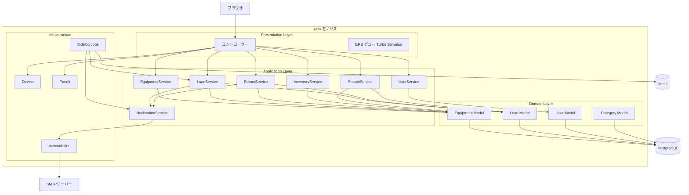
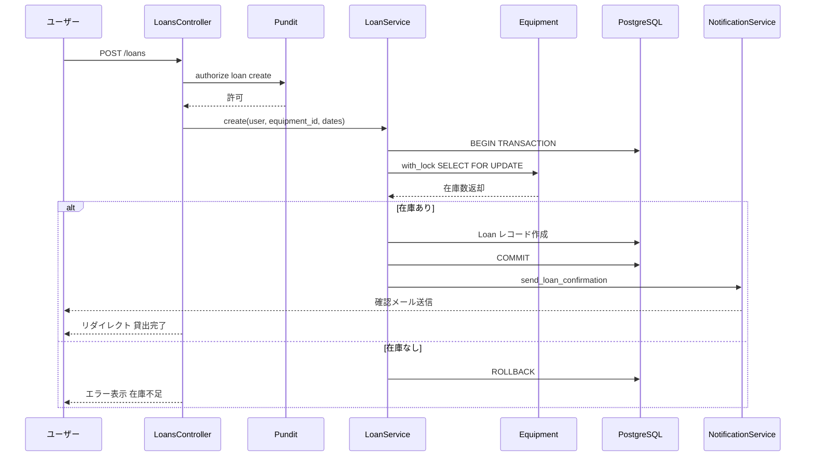
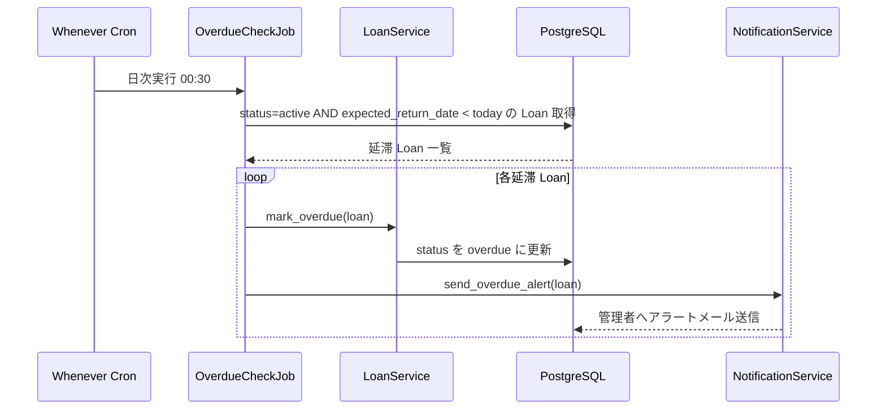
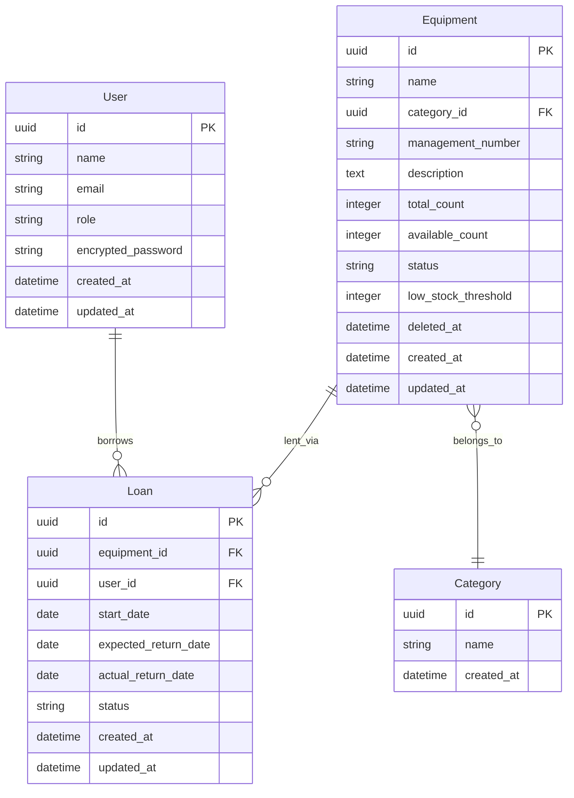

# Design Document: equipment-management

---

## Overview

備品管理システムは、社内の備品（PC・家具・AV機器等）の登録・管理と、社員への貸出・返却を一元管理する業務Webアプリケーションである。管理者は備品マスタの維持・ユーザー管理・貸出状況の監視を担い、一般ユーザーは備品の貸出申請・返却手続きを自身で行える。

Ruby on Rails 7をフルスタックフレームワークとして採用し、Hotwire（Turbo/Stimulus）によってSPAなしでリッチなインタラクションを実現する。PostgreSQLがデータストアを担い、Devise/Punditで認証・認可を管理する。バックグラウンドジョブはSidekiqが担当し、Wheneverと組み合わせた日次バッチで延滞チェックと通知を自動実行する。

本システムはグリーンフィールドの社内業務アプリであり、開発速度と保守性を最優先としたモノリシック構成を採用する。詳細な技術選定の根拠は `research.md` を参照。

### Goals
- 備品の登録・編集・論理削除とカテゴリ管理
- 貸出申請・承認・返却ワークフローの一元管理
- リアルタイム在庫状況の追跡とダッシュボード表示
- 役割ベースアクセス制御（管理者 / 一般ユーザー）
- 延滞通知と在庫不足アラートの自動送信

### Non-Goals
- モバイルネイティブアプリの提供（将来課題）
- 外部システム（購買・会計システム等）との自動連携
- バーコード / QRコードスキャン機能
- 多言語対応（日本語のみ）

---

## Architecture

### Architecture Pattern & Boundary Map

RailsのMVCにService層を追加したLayered Monolithパターンを採用する。コントローラーはリクエスト受付と認可チェックのみを担い、すべてのビジネスロジックはServiceクラスに集約する。Punditポリシーはコントローラー呼び出し直後に評価し、認可チェックがApplication層に侵入しない構成とする。



**Key Decisions**:
- 採用パターン: Layered Monolith — 社内ツールとして開発速度・保守性を優先（`research.md` 参照）
- Service層がビジネスロジックを独占し、コントローラーを薄く保つ
- 論理削除にdiscardまたはparanoia gemを採用し、履歴を永続保持

### Technology Stack

| Layer | Choice / Version | Role | Notes |
|-------|-----------------|------|-------|
| フレームワーク | Ruby on Rails 7 | MVCフレームワーク・Service層 | ユーザー指定 |
| 言語 | Ruby 3.2+ | アプリケーション実装 | |
| フロントエンド | Hotwire Turbo + Stimulus | リッチUI・ページ遷移レス更新 | Rails 7標準 |
| CSS | Tailwind CSS 3 | スタイリング | Rails 7統合 |
| 認証 | Devise 4.x | セッション管理・パスワード管理 | roleカラムを追加拡張 |
| 認可 | Pundit 2.x | ポリシーベースアクセス制御 | リソース別ポリシークラス |
| ORM | ActiveRecord | DB操作 | Rails内蔵 |
| Database | PostgreSQL 15 | データ永続化 | ユーザー指定 |
| 非同期処理 | Sidekiq 7 | バックグラウンドジョブ | 延滞チェック・通知 |
| スケジューラー | Whenever 1.x | Cronジョブ管理 | Sidekiqと連携 |
| メール | ActionMailer | 通知メール送信 | Rails内蔵・SMTPアダプタ |
| テスト | RSpec 3 + FactoryBot | 単体・統合テスト | |

---

## System Flows

### 1. 貸出申請フロー



**Key Decisions**: 在庫確認とLoan作成を同一トランザクション内で実行し、`with_lock`による悲観的ロックで競合を防止（詳細は `research.md`）。

### 2. 返却フロー

```mermaid
sequenceDiagram
    participant Actor as ユーザーまたは管理者
    participant Controller as LoansController
    participant ReturnService as ReturnService
    participant DB as PostgreSQL
    participant Notify as NotificationService

    Actor->>Controller: PATCH /loans/:id/return
    Controller->>ReturnService: process_return(loan_id, actor)
    ReturnService->>DB: BEGIN TRANSACTION
    ReturnService->>DB: Loan status を returned に更新
    ReturnService->>DB: actual_return_date を記録
    ReturnService->>DB: Equipment available_count をインクリメント
    ReturnService->>DB: COMMIT
    ReturnService-->>Controller: 成功
    Controller-->>Actor: リダイレクト 返却完了
```

### 3. 延滞チェックバッチフロー



---

## Requirements Traceability

| Requirement | Summary | Components | Interfaces | Flows |
|-------------|---------|------------|------------|-------|
| 1.1〜1.6 | 備品登録・管理 | EquipmentsController, EquipmentService, Equipment | GET/POST/PATCH/DELETE /equipments | — |
| 2.1〜2.6 | 貸出管理 | LoansController, LoanService, Loan, Equipment | POST /loans, PATCH /loans/:id/approve | 貸出申請フロー |
| 3.1〜3.5 | 返却管理 | LoansController, ReturnService, Loan | PATCH /loans/:id/return | 返却フロー |
| 4.1〜4.5 | 在庫・状態管理 | EquipmentsController, InventoryService, Equipment | PATCH /equipments/:id, GET /admin/dashboard | — |
| 5.1〜5.9 | 検索・一覧表示 | EquipmentsController, SearchService, LoansController | GET /equipments, GET /loans | — |
| 6.1〜6.6 | ユーザー・権限管理 | Devise, Pundit, Admin::UsersController, UserService | /admin/users, Devise routes | — |

---

## Components and Interfaces

### コンポーネント一覧

| Component | Layer | Intent | Req Coverage | Key Dependencies | Contracts |
|-----------|-------|--------|--------------|-----------------|-----------|
| EquipmentsController | Presentation | 備品CRUDエンドポイント | 1.1〜1.6, 5.1〜5.9 | EquipmentService, SearchService, Pundit (P0) | API |
| LoansController | Presentation | 貸出・返却エンドポイント | 2.1〜2.6, 3.1〜3.5 | LoanService, ReturnService, Pundit (P0) | API |
| Admin::DashboardController | Presentation | 管理者ダッシュボード | 4.4 | InventoryService, Pundit (P0) | API |
| Admin::UsersController | Presentation | ユーザー管理 | 6.1〜6.6 | UserService, Pundit (P0) | API |
| EquipmentService | Application | 備品CRUD・論理削除 | 1.1〜1.6 | Equipment, Category (P0) | Service |
| LoanService | Application | 貸出申請・在庫ロック・ステータス管理 | 2.1〜2.6 | Loan, Equipment, NotificationService (P0) | Service |
| ReturnService | Application | 返却処理・在庫回復 | 3.1〜3.5 | Loan, Equipment (P0) | Service |
| InventoryService | Application | ステータス変更・ダッシュボードサマリー | 4.1〜4.5 | Equipment (P0) | Service |
| SearchService | Application | 検索・フィルタ・ページネーション | 5.1〜5.9 | Equipment, Loan (P0) | Service |
| UserService | Application | ユーザーCRUD・パスワード変更 | 6.4〜6.6 | User (P0) | Service |
| NotificationService | Application | メール通知ルーティング | 2.4, 4.5 | ActionMailer, LoanMailer (P0) | Service |
| OverdueCheckJob | Infrastructure | 日次延滞チェックバッチ | 3.3, 3.4 | LoanService, NotificationService (P0) | Batch |
| Equipment | Domain | 備品集約ルート | 1.5, 4.1 | Category, Loan (P0) | State |
| Loan | Domain | 貸出集約ルート | 2.5, 3.3 | Equipment, User (P0) | State |
| User | Domain | ユーザーエンティティ | 6.1 | Loan (P1) | State |
| EquipmentPolicy | Infrastructure | 備品操作認可 | 1.3, 6.3 | Pundit, User (P0) | — |
| LoanPolicy | Infrastructure | 貸出操作認可 | 6.3 | Pundit, User (P0) | — |

---

### Application Layer

#### LoanService

| Field | Detail |
|-------|--------|
| Intent | 貸出申請の受付・在庫確認・悲観的ロックによる競合制御・ステータス管理 |
| Requirements | 2.1, 2.2, 2.3, 2.4, 2.5, 2.6 |

**Responsibilities & Constraints**
- 貸出申請時にEquipmentを`with_lock`（SELECT FOR UPDATE）で取得し、在庫確認とLoan作成をアトミックに処理する
- 管理者承認フローが有効な場合、初期ステータスは`pending_approval`とし、`approve`呼び出し時に`active`へ遷移する
- Loan作成成功後にNotificationServiceへ通知を委譲する（メール失敗はメイン処理を中断しない）

**Dependencies**
- Inbound: LoansController — 貸出申請リクエスト (P0)
- Inbound: OverdueCheckJob — 延滞マーク要求 (P0)
- Outbound: Equipment — `with_lock`による在庫確認・更新 (P0)
- Outbound: Loan — 貸出レコード作成・ステータス変更 (P0)
- Outbound: NotificationService — 貸出確認メール送信 (P1)

**Contracts**: Service [✓] / API [ ] / Event [ ] / Batch [ ] / State [ ]

##### Service Interface

```ruby
# Result型: { success: true, loan: Loan } | { success: false, error: Symbol, message: String }

class LoanService
  # @param user [User]
  # @param equipment_id [String]
  # @param start_date [Date]
  # @param expected_return_date [Date]
  # @return [Hash]
  def create(user:, equipment_id:, start_date:, expected_return_date:) end

  # @param loan_id [String]
  # @return [Hash]
  def approve(loan_id:) end

  # @param loan [Loan]
  # @return [void]
  def mark_overdue(loan:) end
end
```

- Preconditions: `user`は認証済み、`equipment_id`は存在する備品、`expected_return_date > start_date`
- Postconditions: Loan作成成功時、`Equipment#available_count`が1減少する
- Invariants: 在庫確認とLoan作成は同一トランザクション内で実行する

**Implementation Notes**
- Integration: `equipment.with_lock { ... }` でSELECT FOR UPDATEを使用。ロック取得後に`available_count > 0`を再確認する
- Validation: `expected_return_date`のバリデーションはトランザクション外で事前実施し、ロック時間を最小化する
- Risks: 長時間ロックによる待ち — バリデーションをロック前に完了させることで軽減

---

#### ReturnService

| Field | Detail |
|-------|--------|
| Intent | 貸出レコードの返却処理・実返却日記録・在庫回復 |
| Requirements | 3.1, 3.2, 3.3, 3.4, 3.5 |

**Responsibilities & Constraints**
- Loanステータスが`active`または`overdue`のレコードのみ返却処理を受け付ける
- Loan更新とEquipment#available_countのインクリメントを同一トランザクションで実行する

**Dependencies**
- Inbound: LoansController — 返却リクエスト (P0)
- Outbound: Loan — ステータス・返却日更新 (P0)
- Outbound: Equipment — `available_count`インクリメント (P0)

**Contracts**: Service [✓] / API [ ] / Event [ ] / Batch [ ] / State [ ]

##### Service Interface

```ruby
class ReturnService
  # @param loan_id [String]
  # @param actor [User]
  # @return [Hash]
  def process_return(loan_id:, actor:) end
end
```

- Preconditions: Loanのステータスが`active`または`overdue`である
- Postconditions: `Loan#status = returned`、`Loan#actual_return_date = Date.today`、`Equipment#available_count += 1`
- Invariants: Loan更新とEquipment更新は同一トランザクション内で実行する

---

#### NotificationService

| Field | Detail |
|-------|--------|
| Intent | 通知種別に応じてLoanMailerへ委譲するルーティング層 |
| Requirements | 2.4, 4.5 |

**Responsibilities & Constraints**
- メール送信は`deliver_later`でSidekiqキューに非同期投入し、メイン処理をブロックしない
- 送信エラーはrescueしてログ記録する（メール失敗がビジネスロジックを中断しないこと）

**Dependencies**
- Inbound: LoanService, OverdueCheckJob (P0)
- Outbound: LoanMailer — メール生成・送信 (P0)
- External: SMTPサーバー — メール配信 (P1)

**Contracts**: Service [✓] / API [ ] / Event [ ] / Batch [ ] / State [ ]

##### Service Interface

```ruby
class NotificationService
  # @param loan [Loan]
  # @return [void]
  def send_loan_confirmation(loan:) end

  # @param loan [Loan]
  # @return [void]
  def send_overdue_alert(loan:) end

  # @param equipment [Equipment]
  # @return [void]
  def send_low_stock_alert(equipment:) end
end
```

**Implementation Notes**
- Integration: `LoanMailer.loan_confirmation(loan).deliver_later` でSidekiqに投入
- Risks: SMTP障害時のメール未達 — `deliver_later`のリトライ機構で自動再送

---

#### OverdueCheckJob

| Field | Detail |
|-------|--------|
| Intent | 日次バッチによる延滞Loanの一括検出・ステータス更新・管理者通知 |
| Requirements | 3.3, 3.4 |

**Contracts**: Service [ ] / API [ ] / Event [ ] / Batch [✓] / State [ ]

##### Batch / Job Contract
- Trigger: Wheneverによる毎日00:30のCron実行（`config/schedule.rb`で管理）
- Input / validation: `Loan.where(status: :active).where("expected_return_date < ?", Date.today)`
- Output / destination: 対象Loan#status → `overdue`、管理者への通知メール
- Idempotency & recovery: 同一Loanへの重複実行はstatusが`overdue`のため検索条件に一致せず冪等性を自然に確保。失敗時はSidekiqのデッドキューに格納し、Sidekiq Webで再実行可能。

---

### Presentation Layer

#### EquipmentsController

| Field | Detail |
|-------|--------|
| Intent | 備品一覧・詳細・CRUD操作のHTTPエンドポイント |
| Requirements | 1.1〜1.6, 5.1〜5.9 |

**Contracts**: Service [ ] / API [✓] / Event [ ] / Batch [ ] / State [ ]

##### API Contract

| Method | Endpoint | Request | Response | Errors |
|--------|----------|---------|----------|--------|
| GET | /equipments | query: keyword, category_id, status, page, sort | HTML 一覧ページ | — |
| GET | /equipments/:id | — | HTML 詳細ページ | 404 |
| POST | /equipments | equipment params | redirect 詳細 | 403, 422 |
| PATCH | /equipments/:id | equipment params | redirect 詳細 | 403, 422 |
| DELETE | /equipments/:id | — | redirect 一覧 | 403, 422 貸出中 |

#### LoansController

| Field | Detail |
|-------|--------|
| Intent | 貸出申請・承認・返却操作のHTTPエンドポイント |
| Requirements | 2.1〜2.6, 3.1〜3.5 |

**Contracts**: Service [ ] / API [✓] / Event [ ] / Batch [ ] / State [ ]

##### API Contract

| Method | Endpoint | Request | Response | Errors |
|--------|----------|---------|----------|--------|
| GET | /loans | query: user_id, equipment_id, status, date_from, date_to, page | HTML 一覧ページ | — |
| POST | /loans | equipment_id, start_date, expected_return_date | redirect 一覧 | 403, 422 在庫不足 |
| PATCH | /loans/:id/approve | — | redirect 一覧 | 403 非管理者 |
| PATCH | /loans/:id/return | — | redirect 一覧 | 422 未貸出中 |

---

### Domain Layer

#### Equipment（ActiveRecord Model）

**Responsibilities & Constraints**
- 備品集約ルート。カテゴリへの参照とLoanへのhas_many関係を保有する
- `available_count`は`total_count`から`active`状態のLoan数を差し引いた値で管理する
- `deleted_at`による論理削除（discardまたはparanoia gem）で履歴を永続保持する

**Contracts**: Service [ ] / API [ ] / Event [ ] / Batch [ ] / State [✓]

##### State Management
- State model: `status` enum — `available`, `in_use`, `repair`, `disposed`
- Persistence: `status`が`repair`または`disposed`の場合、貸出申請フォームで選択不可とする（LoanServiceで事前チェック）
- Concurrency strategy: 貸出申請時はLoanServiceのSELECT FOR UPDATEで排他制御（本モデルは直接ロックしない）

#### Loan（ActiveRecord Model）

**Contracts**: Service [ ] / API [ ] / Event [ ] / Batch [ ] / State [✓]

##### State Management
- State model: `status` enum — `pending_approval`, `active`, `returned`, `overdue`
- 状態遷移:
  - `pending_approval` → `active`（管理者承認 / `LoanService#approve`）
  - `active` → `returned`（返却処理 / `ReturnService#process_return`）
  - `active` → `overdue`（延滞チェックジョブ / `LoanService#mark_overdue`）
  - `overdue` → `returned`（延滞後の返却処理 / `ReturnService#process_return`）
- Persistence: `actual_return_date`は返却処理時のみセットされる

---

## Data Models

### Domain Model

**集約ルート**:
- `Equipment` — 備品マスタ。在庫カウント・ステータスを管理。貸出可否の判定ロジックを保有。
- `Loan` — 貸出ライフサイクル。申請〜返却までの状態遷移を管理。

**値オブジェクト**: `EquipmentStatus`、`LoanStatus`（ActiveRecord enumで表現）

**ビジネスルール・不変条件**:
- `Equipment#available_count >= 0`を常に保証
- `Loan#expected_return_date > Loan#start_date`
- `status = active`または`overdue`のLoanのみ返却処理可能
- `deleted_at IS NOT NULL`の備品は貸出不可

### Logical Data Model



**整合性ルール**:
- Equipment論理削除時は`available_count = 0`かつアクティブLoanなしを事前確認する（EquipmentService責務）
- `Loan#equipment_id`は論理削除済み備品を参照できる（履歴保持のため外部キー制約は削除フラグで代替）

### Physical Data Model

**主要インデックス**:

| Table | Index | 用途 |
|-------|-------|------|
| equipments | `management_number` UNIQUE | 重複チェック（1.6） |
| equipments | `(status, deleted_at)` | 在庫フィルタ（4.1, 5.1） |
| loans | `(status, expected_return_date)` | 延滞チェックバッチ（3.3） |
| loans | `(user_id, status)` | ユーザー貸出一覧（5.7, 6.5） |
| loans | `(equipment_id, status)` | 備品別貸出状況（5.8） |
| users | `email` UNIQUE | Devise認証 |

**PostgreSQL 型定義（主要カラム）**:
- `id`: uuid DEFAULT gen_random_uuid() PRIMARY KEY（全テーブル共通）
- `Equipment#status`: varchar(20) CHECK IN ('available', 'in_use', 'repair', 'disposed')
- `Loan#status`: varchar(30) CHECK IN ('pending_approval', 'active', 'returned', 'overdue')
- `User#role`: varchar(20) CHECK IN ('admin', 'user')

---

## Error Handling

### Error Strategy
- バリデーションエラーはActiveRecord `errors`を通じてビュー層に返し、Turbo Streamsでフォームを再描画する
- サービス層のエラーは`{ success: Boolean, error: Symbol, message: String }`の統一Hashで表現する
- 認可エラーは`Pundit::NotAuthorizedError`をApplicationControllerでrescueし、403ページを表示する

### Error Categories and Responses

**User Errors (4xx)**:
- 422 バリデーションエラー → フォームにfield-levelエラーメッセージ表示（Turbo Streams再描画）
- 401 未認証 → Deviseのログインページへリダイレクト
- 403 権限不足 → 「操作権限がありません」エラーページ
- 404 リソース未存在 → 標準404ページ

**Business Logic Errors (422)**:
- 在庫不足での貸出申請 → 「現在在庫がありません」フラッシュメッセージ
- 貸出中備品の削除 → 「貸出中のため削除できません」エラー
- 管理番号重複 → フォームの管理番号フィールドにインラインエラー
- 不正な状態遷移 → 「この操作は実行できません」エラー

**System Errors (5xx)**:
- DB接続エラー → 503ページ + Railsログへ記録
- Sidekiqジョブ失敗 → Sidekiq Webのデッドキューへ格納 + エラーログ記録

### Monitoring
- Railsの本番ログ + `Rails.logger`によるService層エラー記録
- `/sidekiq`（管理者のみ）でSidekiq Webダッシュボードを公開し、ジョブ状態を監視

---

## Testing Strategy

### Unit Tests（RSpec）
- `LoanService` — 在庫確認ロジック・トランザクション・悲観的ロック・状態遷移・承認フロー
- `ReturnService` — 返却処理・在庫回復・不正状態からの返却ブロック
- `EquipmentService` — CRUD・管理番号重複チェック・貸出中削除ブロック・論理削除
- `OverdueCheckJob` — 延滞対象の正確な抽出・ステータス更新・冪等性確認
- Punditポリシー — 管理者/一般ユーザー別の許可/拒否ロジック全パターン

### Integration Tests（RSpec + Capybara）
- 貸出申請フロー（在庫あり・在庫なし・同時申請競合）
- 返却フロー（通常返却・延滞後返却）
- 備品一覧の検索・フィルタリング・ページネーション・ソート
- 管理者ダッシュボードのサマリー表示

### E2E Tests（Capybara + Selenium）
- 管理者によるユーザー登録〜権限設定の全フロー
- 一般ユーザーの貸出申請〜返却完了の全フロー
- 未認証ユーザーのアクセス制御確認

### Performance Tests
- 備品一覧500件表示のレスポンスタイム（目標: 500ms以内）
- 延滞チェックジョブ1000件処理の完了時間（目標: 60秒以内）
- 同時10ユーザーによる貸出申請の競合テスト

---

## Security Considerations

- **認証**: Deviseのbcryptハッシュ化・セッション管理・CSRF保護（Rails標準）を使用
- **認可**: `verify_authorized`をApplicationControllerに設定し、Punditポリシー適用漏れをコンパイル時に検出
- **SQLインジェクション**: ActiveRecordのプレースホルダーを使用。生SQLは記述しない
- **大量データ対策**: 一覧表示は1ページ上限20件を強制。`page`パラメータなしのリクエストはデフォルトで1ページ目を返す
- **パスワード**: Deviseの`password_length`を最低8文字に設定。HTTPS環境での利用を前提とする
- **Sidekiq Web**: `/sidekiq`は`authenticate :user, ->(u) { u.admin? }`で管理者のみアクセス可

---

## Supporting References
詳細な技術選定根拠・アーキテクチャ比較・リスク分析は `research.md` を参照。
