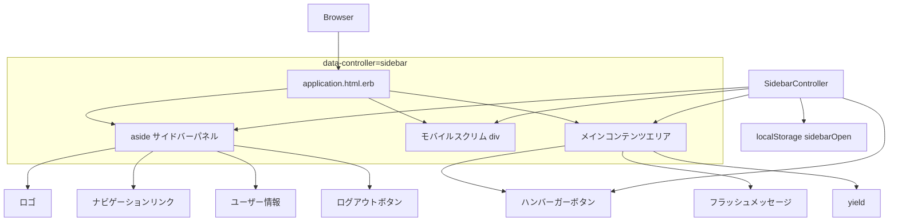
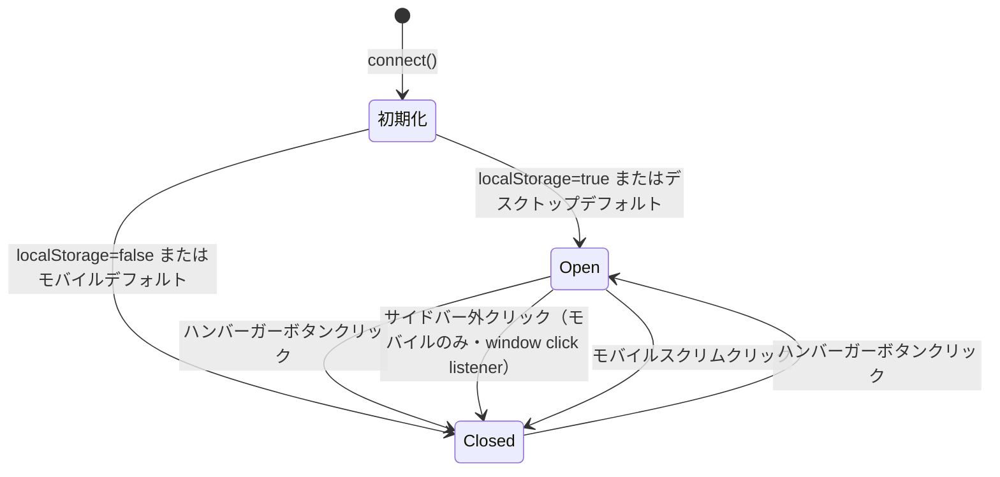

# Design Document: hamburger-sidebar

## Overview

現在の上部ナビゲーションヘッダーを左サイドバーに移設し、ハンバーガーボタンで開閉可能にする。対象ファイルは `app/views/layouts/application.html.erb`（レイアウト再構成）と新規 Stimulus コントローラー `sidebar_controller.js` の 2 点のみ。既存の認証・認可・ルーティングには一切変更を加えない。

**Purpose**: ナビゲーションを左サイドバーに移設することでコンテンツ表示領域を最大化し、ハンバーガーボタンによる開閉でユーザーが任意にレイアウトを調整できるようにする。
**Users**: ログイン済みの一般ユーザーおよび管理者が全ページで利用する。
**Impact**: `<header>` 要素を廃止し、ページ全体のレイアウト構造を「上部ヘッダー + フルwidth main」から「左サイドバー + メインコンテンツエリア」へ変更する。

### Goals

- 上部ヘッダーを廃止し、同等のナビゲーション機能を左サイドバーで提供する
- ハンバーガーボタンによるサイドバー開閉・状態永続化（`localStorage`）を実現する
- デスクトップ・モバイル両対応のレスポンシブレイアウトを維持する

### Non-Goals

- サイドバーのデザインテーマ変更や新規ナビゲーション項目の追加
- 認証・認可・ルーティングへの変更
- Devise / Pundit / Service Object 層への変更
- サーバーサイドでのサイドバー状態管理（DB 保存等）

---

## Architecture

### Existing Architecture Analysis

現在の `application.html.erb` は `user_signed_in?` のガードのもとで `<header>` 内に以下を配置している。

- ロゴリンク
- ナビゲーションリンク（一般ユーザー向け 3 件 + 管理者向け 3 件、`current_user.admin?` で条件分岐）
- ユーザー名・ロール表示
- ログアウトボタン（`button_to`、`method: :delete`）

`<main>` は `max-w-7xl mx-auto px-4 sm:px-6 lg:px-8 py-6` で中央配置。フラッシュメッセージは `<header>` の直後・`<main>` の外に配置されている。

変更後はこれらを左サイドバー（`<aside>`）に移設し、メインコンテンツエリアと横並びにする。

### Architecture Pattern & Boundary Map



**Architecture Integration**:
- Selected pattern: Stimulus Controller + CSS transition。既存の Hotwire パターンを踏襲。
- Domain boundaries: レイアウト層のみ。コントローラー・サービス・モデル層は無変更。
- Existing patterns preserved: Tailwind CSS クラスによるスタイリング、`user_signed_in?` / `current_user.admin?` によるロール分岐、`button_to` によるログアウト。
- New components rationale: `SidebarController` は開閉状態管理・`localStorage` 永続化・click-outside 検出の責務を担うため独立コントローラーとして分離。
- Steering compliance: Service Object パターン・認可ロジックには触れず、ビュー層のみで閉じた変更。

### Technology Stack

| Layer | Choice / Version | Role | Notes |
|-------|-----------------|------|-------|
| View テンプレート | ERB（Rails 8.1.2） | レイアウト HTML 構造の再定義 | `application.html.erb` のみ変更 |
| CSS | Tailwind CSS（既存） | サイドバー・メインエリアのレイアウト・トランジション | `bin/rails tailwindcss:build` が必要 |
| JavaScript | Stimulus（既存） | 開閉状態管理・localStorage・click-outside | `sidebar_controller.js` を新規追加 |
| 状態永続化 | localStorage（ブラウザ標準） | Turbo Drive ページ遷移後の状態復元 | キー: `"sidebarOpen"`, 値: `"true"/"false"` |

---

## System Flows

### サイドバー開閉フロー



Key Decisions:
- `connect()` は冪等に実装し、Turbo Frame 再接続時でも二重初期化が起きない設計とする。
- `localStorage` に値が存在しない場合は `window.matchMedia` でブレークポイント判定してデフォルトを決定する。

---

## Requirements Traceability

| 要件 | 概要 | コンポーネント | インターフェース | フロー |
|------|------|---------------|-----------------|--------|
| 1.1 | ヘッダー廃止・サイドバー表示 | application.html.erb | — | — |
| 1.2 | ロゴ・ナビ・ユーザー情報・ログアウトをサイドバーに配置 | application.html.erb | — | — |
| 1.3 | 管理者ロール時に管理者リンク表示 | application.html.erb | — | — |
| 1.4 | 一般ユーザーに管理者リンク非表示 | application.html.erb | — | — |
| 1.5 | 現在ページのナビリンクをアクティブ表示 | application.html.erb | — | — |
| 2.1 | ハンバーガーボタン常時表示 | application.html.erb | — | — |
| 2.2 | ボタンクリックで開閉トグル | SidebarController#toggle | State | 開閉フロー |
| 2.3 | 閉時にメインコンテンツ幅拡張 | SidebarController + application.html.erb | State | — |
| 2.4 | 開時にナビラベルテキスト表示 | application.html.erb + SidebarController | State | — |
| 2.5 | 閉時にラベル非表示（折りたたみ） | application.html.erb + SidebarController | State | — |
| 2.6 | 開閉状態を localStorage で永続化 | SidebarController | State | 開閉フロー |
| 2.7 | サイドバー外クリックで閉じる | SidebarController#handleWindowClick | State | 開閉フロー |
| 3.1 | モバイル: デフォルト閉 | SidebarController + Tailwind CSS | State | — |
| 3.2 | モバイル: オーバーレイとして展開 | application.html.erb + Tailwind CSS | — | — |
| 3.3 | デスクトップ: デフォルト開 | SidebarController + Tailwind CSS | State | — |
| 3.4 | モバイル: スクリム表示 | application.html.erb | — | — |
| 4.1 | ハンバーガーボタンに aria-expanded 付与 | SidebarController | State | — |
| 4.2 | 開閉アニメーション（トランジション） | Tailwind CSS transition | — | — |
| 4.3 | フラッシュメッセージをメインエリアに表示 | application.html.erb | — | — |
| 4.4 | 未ログイン時はサイドバー非表示 | application.html.erb | — | — |

---

## Components and Interfaces

### コンポーネントサマリー

| コンポーネント | レイヤー | Intent | 要件カバレッジ | 主要依存 | コントラクト |
|--------------|---------|--------|-------------|---------|-------------|
| SidebarController | JavaScript / Stimulus | サイドバーの開閉状態管理・localStorage 永続化・click-outside 検出 | 2.2〜2.7, 3.1, 3.3, 4.1 | application.html.erb (P0), localStorage (P0) | State |
| application.html.erb | View / Layout | レイアウト HTML 構造・ロール別ナビ・アクティブ状態 | 1.1〜1.5, 2.1, 3.2, 3.4, 4.2〜4.4 | SidebarController (P0) | — |

---

### JavaScript / Stimulus

#### SidebarController

| Field | Detail |
|-------|--------|
| Intent | サイドバーの開閉状態を管理し、localStorage での永続化・click-outside 検出・aria-expanded 更新を担う |
| Requirements | 2.2, 2.3, 2.4, 2.5, 2.6, 2.7, 3.1, 3.3, 4.1 |

**Responsibilities & Constraints**
- サイドバーの open/closed 状態を唯一の真実源として管理する
- 状態は `localStorage["sidebarOpen"]` に永続化し、Turbo Drive ページ遷移を生き残る
- `connect()` は冪等に実装する（Turbo Frame 再接続で二重初期化しない）
- DOM 操作はすべて Stimulus targets 経由で行い、クラス名を直接 query しない

**Dependencies**
- Inbound: `application.html.erb` — `data-controller`, `data-*-target`, `data-action` の HTML wiring (P0)
- External: `localStorage` — 開閉状態の永続化 (P0)
- External: `window.matchMedia` — デフォルト状態のブレークポイント判定 (P1)

**Contracts**: State [x]

##### State Management

- **State model**:

  | 状態キー | 型 | 保存先 | 説明 |
  |---------|-----|--------|------|
  | `isOpen` | boolean | `localStorage["sidebarOpen"]` | サイドバーが開いているか |

- **Persistence & Consistency**:
  - `localStorage["sidebarOpen"]` に `"true"` / `"false"` の文字列として保存する
  - 値が存在しない場合（初回アクセス）: `window.matchMedia("(min-width: 1024px)").matches` が `true` なら open、false なら closed をデフォルトとする
  - `connect()` 内で必ず `applyState()` を呼び、現在の DOM 状態と localStorage を同期する

- **Concurrency strategy**: クライアントサイド単一スレッド。競合なし。

##### Controller Interface（Stimulus 規約）

```
Targets:
  panel    — <aside> サイドバーパネル要素
  scrim    — モバイルスクリム <div> 要素
  main     — メインコンテンツエリア要素
  hamburger — ハンバーガーボタン <button> 要素

Actions（Public）:
  toggle()                          — 開閉をトグル（ハンバーガーボタンから呼ぶ）
  close()                           — サイドバーを閉じる（スクリムから呼ぶ）
  handleWindowClick(event: Event)   — window click listener。モバイル（lg 未満）かつ panel 外クリック時のみ close() を呼ぶ。デスクトップでは何もしない

Private（内部利用）:
  open()                            — 開く。targets にクラスを付与し aria-expanded=true、localStorage 保存
  applyState(isOpen: Boolean)       — isOpen に応じて targets のクラスと aria-expanded を設定
  saveState(isOpen: Boolean)        — localStorage["sidebarOpen"] に保存
  restoreState() → Boolean|null     — localStorage から値を読む（未設定なら null）
```

**Pre / Post conditions**:
- `toggle()` 前提条件: `panelTarget` が DOM に存在する
- `handleWindowClick(event)` 前提条件: サイドバーが open 状態、かつモバイルサイズ（`window.matchMedia("(min-width: 1024px)").matches === false`）のときのみ `close()` を実行する（デスクトップ・closed 時は何もしない）
- `open()` / `close()` 事後条件: `hamburgerTarget.ariaExpanded` が状態と一致している

**Implementation Notes**
- Integration: `data-action="click@window->sidebar#handleWindowClick"` は `data-controller="sidebar"` 要素（ラッパー）に記述し、window イベントとして登録する
- Validation: `handleWindowClick` 内では先にデスクトップ判定（`window.matchMedia("(min-width: 1024px)").matches`）で早期 return し、次に `panelTarget.contains(event.target)` でサイドバー内クリックを無視する
- Risks: Tailwind の本番ビルドで動的追加クラスが purge される可能性 → 使用する全クラス名を JS 内で完全形の文字列として記述するか CSS safelist に追加する

---

### View / Layout

#### application.html.erb

| Field | Detail |
|-------|--------|
| Intent | ページ全体のレイアウト HTML を提供する。サイドバーとメインコンテンツエリアを横並びに配置し、SidebarController の wiring を定義する |
| Requirements | 1.1, 1.2, 1.3, 1.4, 1.5, 2.1, 3.2, 3.4, 4.2, 4.3, 4.4 |

**Responsibilities & Constraints**
- 既存の `<header>` を廃止し、サイドバー（`<aside>`）＋メインコンテンツラッパーの 2 カラム構造に変更する
- ロール分岐（`current_user.admin?`）・アクティブハイライト（`controller_name` 比較）・`user_signed_in?` ガードの既存ロジックはすべて保持する
- `button_to` によるログアウトボタン（`method: :delete`）はサイドバー内に移設する
- フラッシュメッセージはメインコンテンツエリア内（`<main>` の前）に配置し続ける

**Dependencies**
- Inbound: SidebarController — `data-controller`, `data-*-target`, `data-action` wiring (P0)

**Contracts**: — （ビュー層のため API コントラクト不要）

##### HTML 構造設計

```
<body>
  <!-- user_signed_in? の場合のみ -->
  <div data-controller="sidebar"
       data-action="click@window->sidebar#handleWindowClick">

    <!-- サイドバーパネル (aside) -->
    <aside data-sidebar-target="panel">
      <!-- ロゴ -->
      <!-- ナビゲーションリンク（現行と同一ロジック） -->
      <!-- ユーザー情報 -->
      <!-- ログアウトボタン -->
    </aside>

    <!-- モバイルスクリム -->
    <div data-sidebar-target="scrim"
         data-action="click->sidebar#close">
    </div>

    <!-- メインコンテンツエリア -->
    <div data-sidebar-target="main">

      <!-- ハンバーガーボタン -->
      <button data-sidebar-target="hamburger"
              data-action="click->sidebar#toggle"
              aria-expanded="true"
              aria-label="メニューを開閉する">
        <!-- ☰ アイコン -->
      </button>

      <!-- フラッシュメッセージ（現行と同一） -->

      <main>
        <%= yield %>
      </main>
    </div>

  </div>
  <!-- 未ログイン時は上記 div を出力せず <main> のみ -->
</body>
```

**Implementation Notes**
- Integration: `data-action="click@window->sidebar#handleWindowClick"` はラッパー `<div>` に付与することで window イベントをキャプチャする
- Validation: `user_signed_in?` ガード・`current_user.admin?` 分岐は現行のまま保持し、条件分岐ロジックの変更は行わない
- Risks: フラッシュメッセージのコンテナ位置が変わるため `max-w-7xl` 等のレイアウトクラスを引き継ぐことに注意する

---

## Testing Strategy

### Unit Tests（Stimulus コントローラー）

- `connect()` 時に `localStorage` に値がない場合、画面幅に応じたデフォルト状態が適用されること
- `connect()` 時に `localStorage["sidebarOpen"] = "true"` の場合、open 状態が適用されること
- `toggle()` が open → closed / closed → open を正しく切り替えること
- `close()` 呼び出し後に `hamburgerTarget.ariaExpanded` が `"false"` になること
- `handleWindowClick` でサイドバー内クリックは無視され、外クリックで `close()` が呼ばれること

### Integration Tests（Request Spec）

- ログイン済みユーザーがアクセスしたとき、レスポンス HTML にサイドバー関連の `data-controller="sidebar"` が含まれること
- 未ログイン状態でアクセスしたとき、サイドバー HTML が含まれないこと
- 管理者ユーザーのレスポンスに管理者リンクが含まれること
- 一般ユーザーのレスポンスに管理者リンクが含まれないこと

### E2E / System Tests

- デスクトップ幅でページを開くとサイドバーがデフォルトで表示されていること
- ハンバーガーボタンをクリックするとサイドバーが閉じ、再度クリックすると開くこと
- サイドバーが開いているときにサイドバー外をクリックするとサイドバーが閉じること
- ページ遷移後もサイドバーの開閉状態が保持されること
- モバイルサイズでスクリムをクリックするとサイドバーが閉じること

---

## Security Considerations

- 新規の認証・認可ロジックは発生しない。既存の `before_action :authenticate_user!` および Pundit ポリシーはすべて保持される。
- `localStorage` に保存するのはサイドバーの UI 状態（`"true"/"false"`）のみ。個人情報・セッション情報は含まない。
