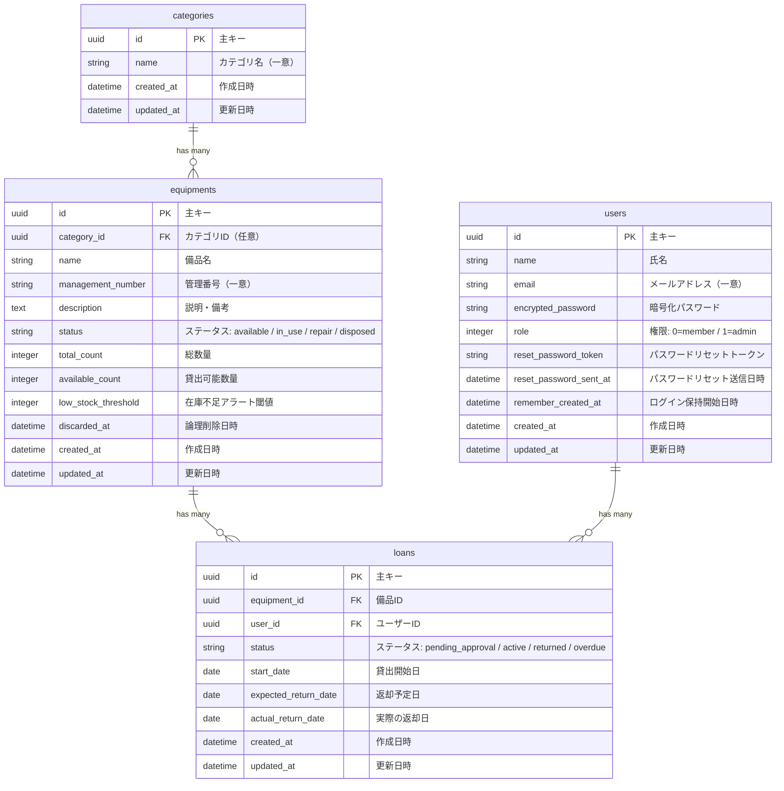

# ER図

```mermaid
erDiagram
    categories {
        uuid id PK "主キー"
        string name "カテゴリ名（一意）"
        datetime created_at "作成日時"
        datetime updated_at "更新日時"
    }

    equipments {
        uuid id PK "主キー"
        uuid category_id FK "カテゴリID（任意）"
        string name "備品名"
        string management_number "管理番号（一意）"
        text description "説明・備考"
        string status "ステータス: available / in_use / repair / disposed"
        integer total_count "総数量"
        integer available_count "貸出可能数量"
        integer low_stock_threshold "在庫不足アラート閾値"
        datetime discarded_at "論理削除日時"
        datetime created_at "作成日時"
        datetime updated_at "更新日時"
    }

    loans {
        uuid id PK "主キー"
        uuid equipment_id FK "備品ID"
        uuid user_id FK "ユーザーID"
        string status "ステータス: pending_approval / active / returned / overdue"
        date start_date "貸出開始日"
        date expected_return_date "返却予定日"
        date actual_return_date "実際の返却日"
        datetime created_at "作成日時"
        datetime updated_at "更新日時"
    }

    users {
        uuid id PK "主キー"
        string name "氏名"
        string email "メールアドレス（一意）"
        string encrypted_password "暗号化パスワード"
        integer role "権限: 0=member / 1=admin"
        string reset_password_token "パスワードリセットトークン"
        datetime reset_password_sent_at "パスワードリセット送信日時"
        datetime remember_created_at "ログイン保持開始日時"
        datetime created_at "作成日時"
        datetime updated_at "更新日時"
    }

    categories ||--o{ equipments : "has many"
    equipments ||--o{ loans : "has many"
    users ||--o{ loans : "has many"
```
